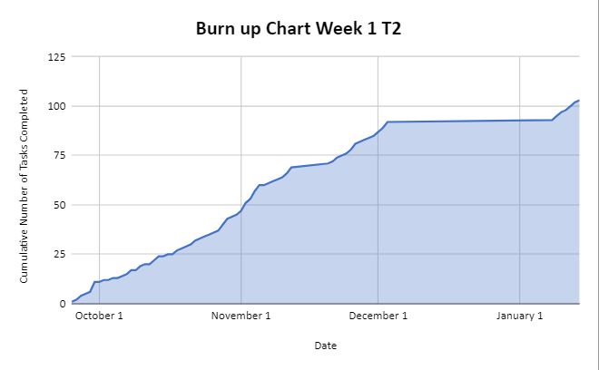
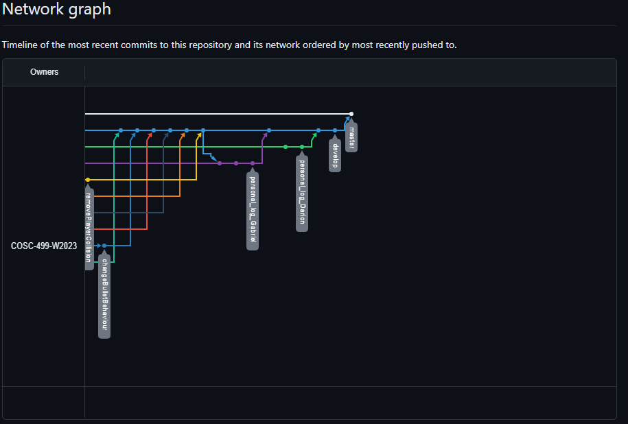

# Team 14 Log - Term 2 - Week 1
- Start Date: January 8
- End Date: January 14

## Milestone Goals:
- This week our team reviewed all client feedback for our design video and document, additionally we also reviewed all student feedback relating to the gameplay decisions we made so that we can properly balance the game and improve player experience. Multiple individuals critiqued friendly fire in the game, so we have decided to remove it going forward. Additionally, we have decided to remove collisions between players, since during testing and when compairing to similar roguelike style games players are able to walk past each other without blocking each other. Our team has also looked into the LootLocker API and have added a leaderboard and associated unit tests which showns completion time for the game. We have also added a new enemy (orc soldier) with directional idle and walking animations, hit animation, and a death animation. In a future milestone we plan to add more enemies with variety in attack styles. 

## Associated Board Tasks
- Review all game feeback and discuss with team how we can improve existing features
- Hold team meeting to dicuss gameplay changes, new abilities and game balancing
- Add leaderboard to game
- Add unit testing for game leaderboard
- Add additional menu which explains controls
- Add new second enemy (orc soldier)
- Add all animations for orc soldier enemy

## Burnup Chart

## Network Graph

## Quick Reminder of Student Name → Username
- Jesse Lazzari → @jesselazzari
- Darion Pescada → @dpescada
- Gabriel Mercier → @guabo
- Kibele Sebnem Yildirim → @kibelesebnemyildirim
- Justin Mckendry → @justinmdry

## Completed Tasks
- Review all game feeback and discuss with team how we can improve existing features
- Held team meeting to dicuss gameplay changes and balancing
- Add leaderboard to game
- Add additional menu which explains controls
- Add new second enemy (orc soldier)
- Add all animations for orc soldier enemy

## In Progress Tasks
- Begin working on features for next milestone such as player abilities and additional menu options

## Updated Test Report 
### [Test Report Documentation Link](../../tests/Test_log.md)
