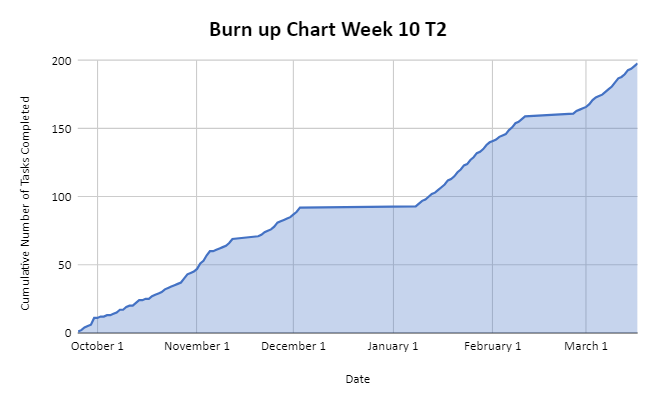
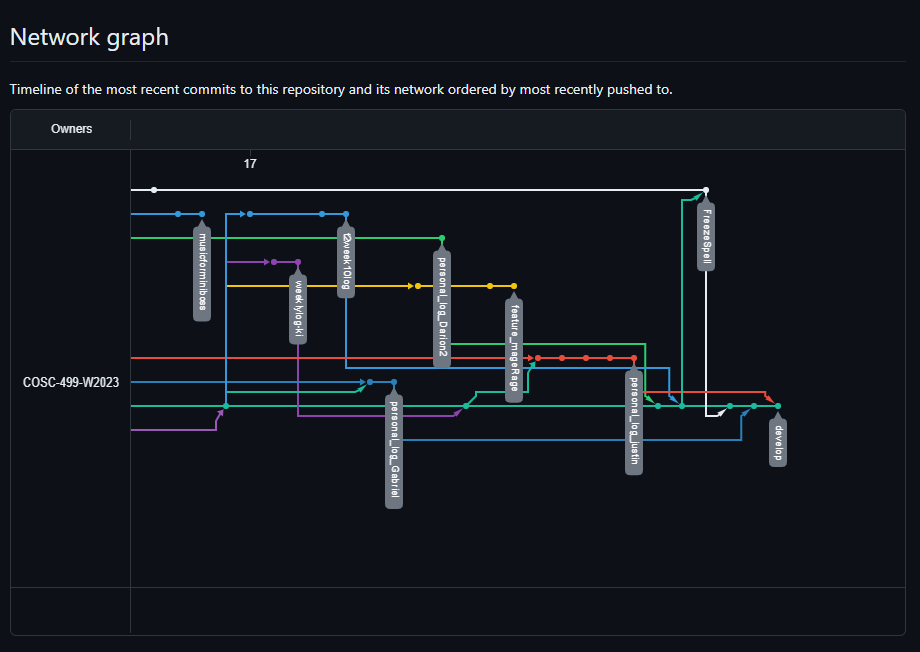

# Team 14 Log - Term 2 - Week 10

- Start Date: March 11
- End Date: March 17

## Milestone Goals:

- This week our team was able to address the issues we had encountered regarding LFS objects and worked towards adding additional gameplay features for the game such as new abilities, and adding more functionality to the final boss encounter. Additionally, in our most recent team meeting we reassessed our goals for which features to complete first ahead of the final milestone where we will release the final version of the game. We have also added more levels and discussed further balancing changes to ensure it is in line with peer testing feedback and player expectations. Overall, we are very happy with how far the game has come thus far! 

## Associated Board Tasks

- Add shield ability
- Add "rage mage" spell ability (increased movement speed, attack, shorter cooldowns)
- Various bug fixes relating to music
- Add shuffling music for the entire game
- Add a different music for the miniboss scene
- Add Freeze spell and associated unit tests
- Create more levels
- Add unit test for summon chad
- Add Unit test for spell pick ups
- Finalize animations, movement and attack selection for final boss
- Add rotating laser attack for final boss
- Address LFS issues
- Add laser obstacle

## Burnup Chart

## Network Graph

## Quick Reminder of Student Name → Username
- Jesse Lazzari → @jesselazzari
- Darion Pescada → @dpescada
- Gabriel Mercier → @guabo
- Kibele Sebnem Yildirim → @kibelesebnemyildirim
- Justin Mckendry → @justinmdry

## Completed Tasks

- Finished the shield spell ability
- Freeze spell and unit test
- Created more levels
- Bug fixes
- Unit test for summon chad
- Unit test for spell pick ups
- Finished animations, movement and attack selection for final boss
- Added rotating laser attack for final boss
- Fixed lfs issues

## In Progress Tasks

- Fix bugs relating to music and shuffling music feature
- Continue work on the rage mage spell
- Continue work on laser obstacle
- Additional unit testing for existing features
- Create more levels
- Add more attacks for final boss encounter

## Test Report 

### [Test Report Documentation Link](../../tests/Test_log.md)
