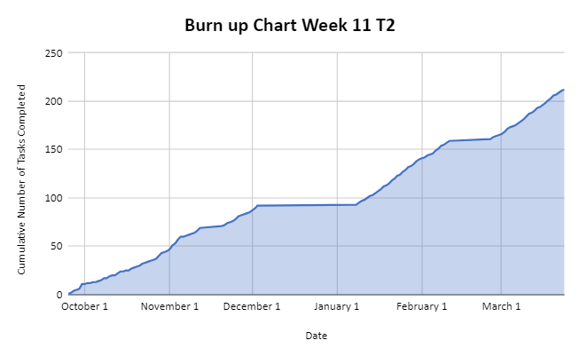
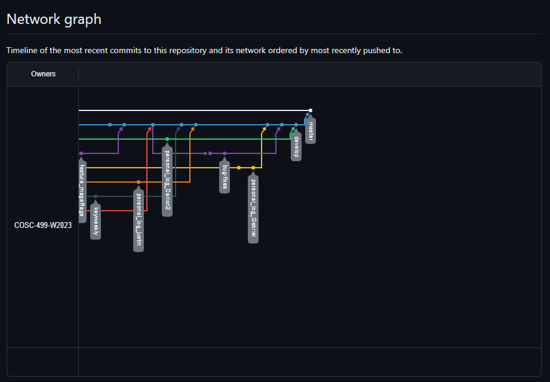

# Team 14 Log - Term 2 - Week 11

- Start Date: March 18
- End Date: March 24

## Milestone Goals:

- As we work towards the next milestone, this week our team worked on additional gameplay features such as new abilities, various additional attacks for the final boss encounter, re-worked existing features such as the item shop, added a new laser obstacle for level design, finalized the implementation for the game's music and shuffling, as well as various bug fixes. Additionally, this week our team compiled the "Installation and Setup" guide for the project which will be added the each of our final reports and the repo's README.

## Associated Board Tasks

- Add Spinning laser level obstacle
- Add Unit tests for laser obstacle
- Re-work Options and Controls Menu button naviation
- Add new spell ability "Mage Rage" (increased movement speed, and fire rate for a short duration)
- Add new spell ability "Rainbow" (randomly selects a spell each time it is activated)
- Add  new attack for final boss which shoots slime enemies at player
- Add phase 2 attacks for final boss (4 directional laser beam, upgraded version of slime shoot attack)
- Add functionality for boss behaviour which cycles between attacks, and switches to phase 2 of the encounter when health is less than 50%
- Update shop design and made spells random
- Add button prompt to pick up spells
- Add button prompt for casting spell in player hud
- Add seeking shot boss attack
- Add more levels
- Fix bugs

## Burnup Chart

## Network Graph

## Quick Reminder of Student Name → Username
- Jesse Lazzari → @jesselazzari
- Darion Pescada → @dpescada
- Gabriel Mercier → @guabo
- Kibele Sebnem Yildirim → @kibelesebnemyildirim
- Justin Mckendry → @justinmdry

## Completed Tasks

- Finished mage rage spell
- Completed the functionality of the rainbow spell
- Added new attack for final boss which shoots slime enemies at player
- Added phase 2 attacks for final boss (4 directional laser beam, upgraded version of slime shoot attack)
- Added functionality for boss behaviour which cycles between attacks, and switches to phase 2 of the encounter when health is less than 50%
- Updated shop design and made spells random
- Added button prompt to pick up spells
- Added button prompt for casting spell in player hud
- Added seeking shot boss attack
- Fixed various bugs

## In Progress Tasks

- Design more levels for final milestone
- Finalize re-worked menus and simplify menu navigation
- Additional unit tests for final boss
- Re-balance timings between final boss attacks

## Test Report 

### [Test Report Documentation Link](../../tests/Test_log.md)
