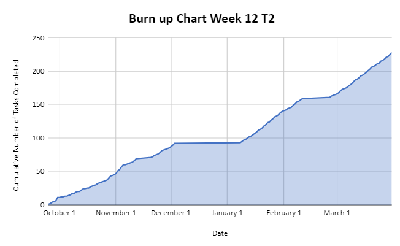
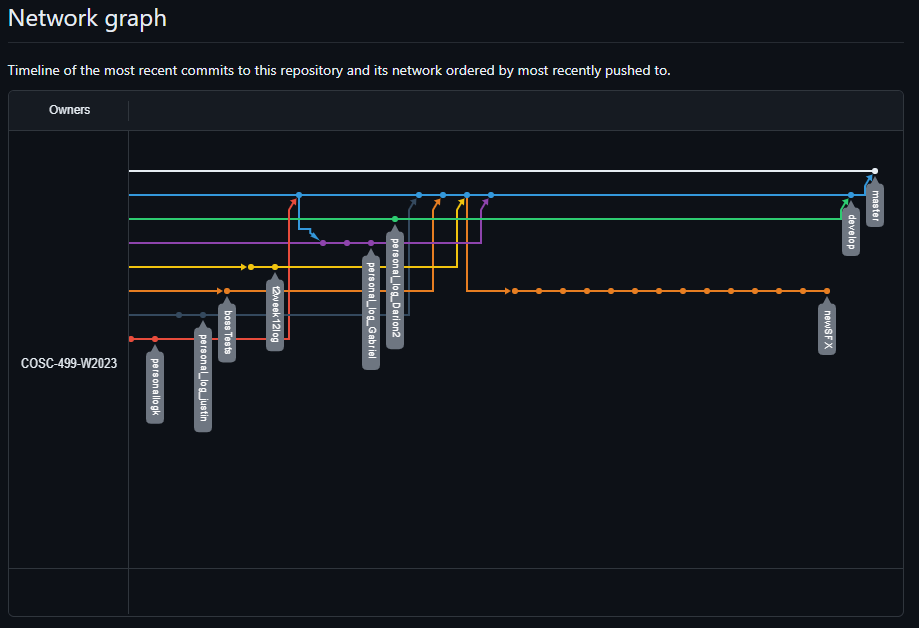

# Team 14 Log - Term 2 - Week 12

- Start Date: March 25
- End Date: March 31

## Milestone Goals & Associated Board Tasks:

- Finish creating levels
- Add difficulties for final boss
- Add updated controller support
- Finalize rebalances of the game
- Add a game over song when you lose and a win song when you beat the game and update unit tests
- Add scatter shot spell
- Add unit test for scatter shot
- Finish rainbow spell functionality and unit test.
- Update build online
- Update test log
- Finalize unit tests for final boss
- Modify final boss attack script timings

## Burnup Chart

## Network Graph

## Quick Reminder of Student Name → Username
- Jesse Lazzari → @jesselazzari
- Darion Pescada → @dpescada
- Gabriel Mercier → @guabo
- Kibele Sebnem Yildirim → @kibelesebnemyildirim
- Justin Mckendry → @justinmdry

## Completed Tasks:

- We have completed all milestone goals as outlined above!

## In Progress Tasks:

- Finalize reports for milestone close

## Test Report:

### [Test Report Documentation Link](../../tests/Test_log.md)
