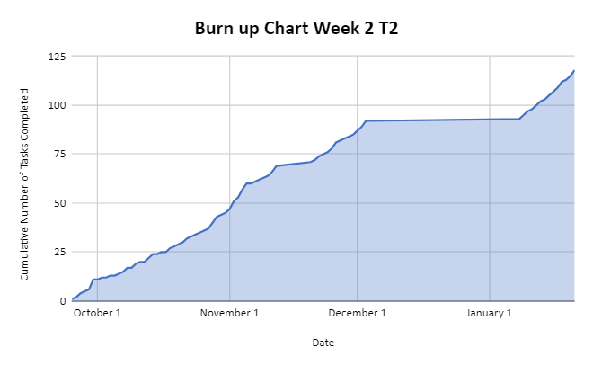

# Team 14 Log - Term 2 - Week 2
- Start Date: January 15
- End Date: January 21

## Milestone Goals:
- This week our team worked on additional level design elements, additional enemy types, leaderboard functionality and additional unit testing for finalized features. Additionally we modified certain gameplay elements such as removing collisions between player bullets and enemy bullets due to player feedback, and added particle animations for bullets. 

## Associated Board Tasks
- Add breakable walls
- Add broken walls
- Add moving walls
- Add red particle effects for player 1 and enemies when bullets are destroyed
- Add blue particle effects for player 2 when bullets are destroyed
- Add new enemy type, Slime with all animations
- Add new enemy type, light armored "bonk" orc with all animations 
- Create multiple leaderboards 
- Add functions to view different leaderboards
- Improve options menu
- Add option to change name on leaderboard
- Add new enemy pathfinding script that allows enemies to randomly move around, constantly chase the player, or charge at the player at certain intervals 
- Add re-worked damage system where players are invulnerable for a short period of time after being hit
- Fix a bug where dead enemies and players kept playing walking after being killed
- Remove collisions between player bullets and enemy bullets due to player feedback

## Burnup Chart

## Network Graph

## Quick Reminder of Student Name → Username
- Jesse Lazzari → @jesselazzari
- Darion Pescada → @dpescada
- Gabriel Mercier → @guabo
- Kibele Sebnem Yildirim → @kibelesebnemyildirim
- Justin Mckendry → @justinmdry

## Completed Tasks
- Added breakable walls
- Added broken walls
- Added moving walls
- Added red particle effects for player 1 and enemies when bullets are destroyed
- Added blue particle effects for player 2 when bullets are destroyed
- Added new enemy type, Slime with all animations
- Added new enemy type, light armored "bonk" orc with all animations 
- Created multiple leaderboards 
- Added functions to view different leaderboards
- Improved options menu
- Added option to change name on leaderboard
- Made new enemy pathfinding script that allows enemies to randomly move around, constantly chase the player, or charge at the player at certain intervals 
- Added re-worked damage system where players are invulnerable for a short period of time after being hit
- Fixed a bug where dead enemies and players kept playing walking after being killed
- Removed collisions between player bullets and enemy bullets due to player feedback

## In Progress Tasks
- Additional unit testing for above features, and work on more player abilities such as dash movement ability, thunder. We will also add additional sword animations for the new light armored orc enemy. 

## Updated Test Report 
### [Test Report Documentation Link](../../tests/Test_log.md)
