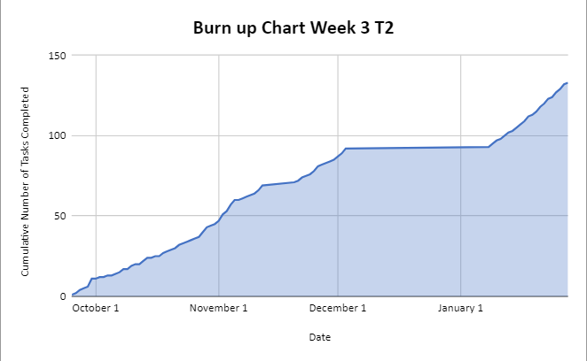
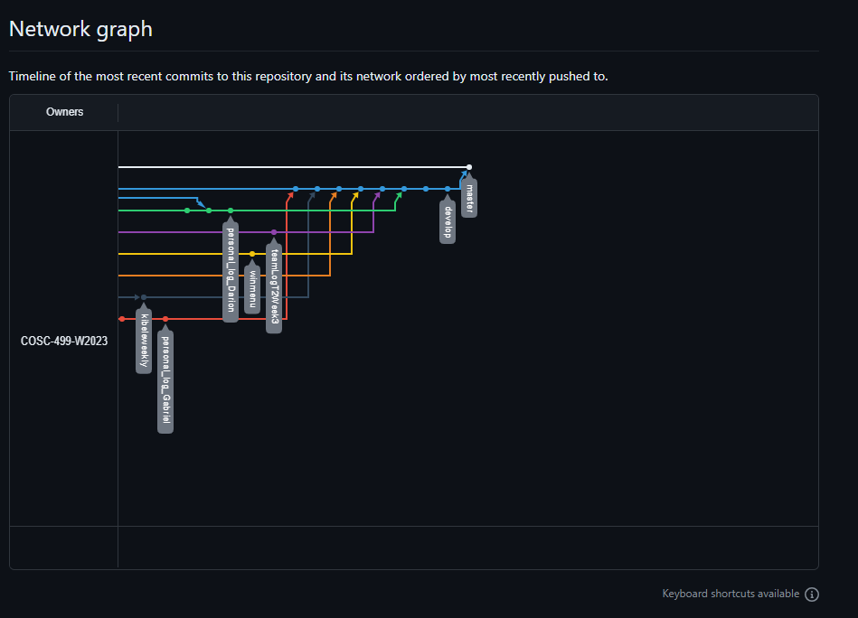

# Team 14 Log - Term 2 - Week 3
- Start Date: January 22
- End Date: January 27

## Milestone Goals:
This week our team work on additional player abilities, gameplay mechanics, and added additional unit testing for our features. The goal of adding abilities was to give the gameplay more variety and provide the player with different ways to defeat enemies and beat a given level. Additionally, this week we aimed to add a dash ability which increased the pace of the game and gives the player more freedom to move around. We also worked towards adding a win screen when a player beats the game which displays your score in time for the peer testing session.

## Associated Board Tasks
- Meet with team to discuss our plan for the upcoming peer testing session 
- Plan out 10 tasks for game testers to complete
- Run trial runs to ensure tasks are completable within time limit
- Add additional gameplay features such as player abilities (fireball ability, lightning ability), movement abilities, and menu options
- Add additional unit testing for existing features (particle effects, broken/breakable/moving walls)
- Complete team log
- Add win menu screen which displays time
- Add dash movement ability
- Add additional unit testing for existing features (particle effects, broken/breakable/moving walls)
- Fix bugs and clean up project (remove unity console log warnings)
- Add sound effects for most game actions
- Add prompts to help user identify interactable objects
- Add respawn system
- Add trap which damages player when they step on it
- Update test log for next milestone

## Burnup Chart

## Network Graph

## Quick Reminder of Student Name → Username
- Jesse Lazzari → @jesselazzari
- Darion Pescada → @dpescada
- Gabriel Mercier → @guabo
- Kibele Sebnem Yildirim → @kibelesebnemyildirim
- Justin Mckendry → @justinmdry

## Completed Tasks
- Added fireball spell and associated unit tests
- Added unit testing for particle effects when player and enemy bullets explode
- Added unit tests for broken/breakable/moving walls
- Added lightning spell
- Added sound effects for most game actions (shooting, player and enemy hit sounds, explosion sounds)
- Added text prompt to prompt player to interact with door/portal
- Added animated arrow above interactable objects
- Added button to main menu which displays controls
- Added dash movement ability
- Added respawn system
- Compile list of peer testing tasks
- Modified sound effects based on team feedback

## In Progress Tasks
- Update test log with information on newly added unit tests for next milestone
- Add additional sound effects for new abilities
- Add additional unit testing for new features (dash ability, lightning ability, new menu options)
- Add trap which damages player when they step on it

## Updated Test Report 
### [Test Report Documentation Link](../../tests/Test_log.md)
