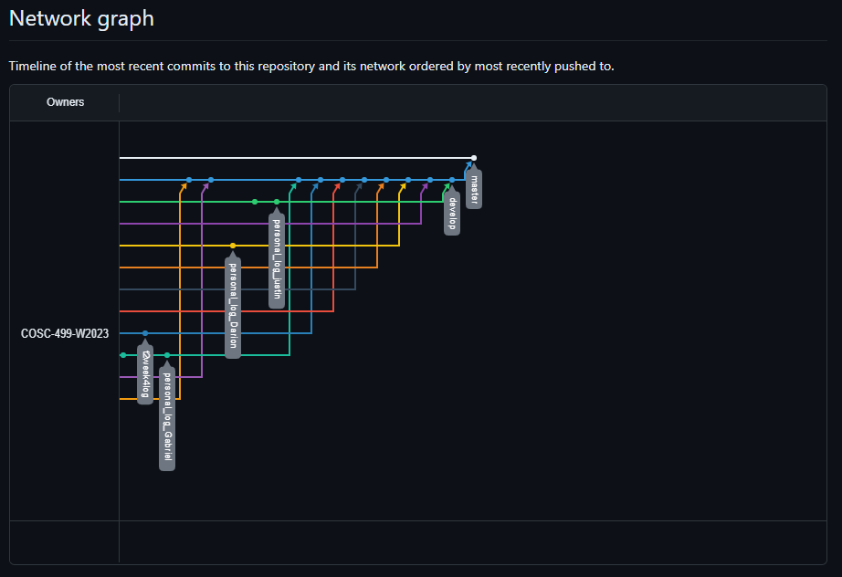

# Team 14 Log - Term 2 - Week 4
- Start Date: January 29
- End Date: February 4

## Milestone Goals:
This week our team succesfully held our first peer testing session. Overall the feedback for the game was incredibly positive and testers found it was enjoyable to play. Moving forward we will be adding additional abillities, different difficulty levels, and adding more levels to the game. Additionally, we are working on a mini-boss for the game which will have more advanced shooting patterns and challenge the player to navigate through the level carfully as they dodge attacks. With the addition of the win-screen, players are now able to beat the game and submit their completion time to the leaderboard.

## Associated Board Tasks
- Add additional player abilities
- Compile relevant peer testing session feedback and discuss with team how we can apply this and improve the game
- Add additional levels which leverage new level design features
- Add mini-boss
- Re-balance game and add different difficulty levels so that is appeals to a larger audience
- Add abillity selecion feature to game, so that players and pick or switch out selected abilitity
- added leaderboard menu to game scene and improved win menu so players can enter a name and submit their scores
- Re-balance ability and movement cooldowns
- Changed how the leaderboards work so players can upload multiple scores under different names from the same device
- Added controller support to all menus and features that previously didn't have controller support
- Triple shot enemy in progress
- Started difficulty menu (design and buttons)
- Updated the hud with a timer showing the user how much time has elapsed.
- Updated hud to display spell icons based on which spell is equipped and also show cooldown

## Burnup Chart

## Network Graph

## Quick Reminder of Student Name → Username
- Jesse Lazzari → @jesselazzari
- Darion Pescada → @dpescada
- Gabriel Mercier → @guabo
- Kibele Sebnem Yildirim → @kibelesebnemyildirim
- Justin Mckendry → @justinmdry

## Completed Tasks
- Created 3 test levels for peer testing session which implement new level design features (broken walls, breakable walls, moving walls)
- Updated the hud with a timer showing user how much time has elapsed. - updated hud to display spell icons based on which spell is equipped and also show cooldown
- Add unit testing for lightning spell ability
- Add unit testing for dash ability effects
- Complete peer testing session and compile relevant peer feedback
- Additional bug fixes
- Added new attack pattern "triple-shot" to the Orc Soldier enemy to increase enemy type variety
- Added win-screen when player(s) beat all levels
- Added leaderboard menu to game scene and improved win menu so players can enter a name and submit their scores
- Changed how the leaderboards work so players can upload multiple scores under different names from the same device
- Added controller support to all menus and features that previously didn't have controller support
- Improved controller support to allow players to easily switch between controller and mouse and keyboard

## In Progress Tasks
- Work on additional levels for the game
- Add menu to select difficulty level (4 difficulties in total)
- Add additional abilities
- Add menu or in-game shop so that players can choose or switch their abilities
- Re-balance the game so that gameplay is more enjoyable
- Discuss different difficulties with the team and how we can differentiate each of them
- Continue work on mini-boss (a stand-alone enemy encounter with more advanced attack patterns)

## Peer Testing Google Form Questionnaire Comments:
- Fire ball and dash are nice abilities and work well. Overall it was fun to play
- Simple controls and easy to understand objective
- Gameplay was fun and responsive, very nice design, easy to navigate, easy to learn
- Design is just awesome, everything works as intended, and I didn't notice any critical bugs that'd affect the gameplay
- The ui looks generically intuitive, graphic looks pretty nice on the game. It pretty easy to navigate and gets a hands on of the controls.
- I liked the aesthetic of the game, the dash feature and the fireball spell is a good touch
- I loved the movement and the ability to strafe around the enemies while being able to aim at the enemies
- Design (fonts/retro vibe) and simplicity. Also contrast is very good

## Test Report 
### [Test Report Documentation Link](../../tests/Test_log.md)
