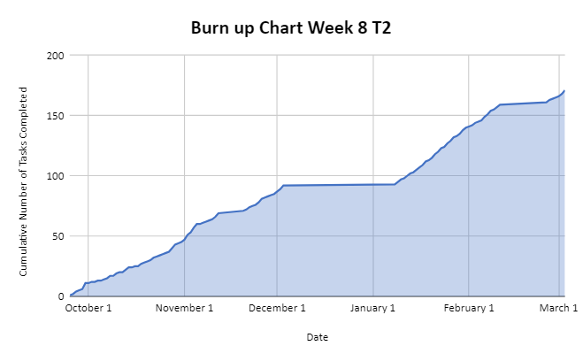
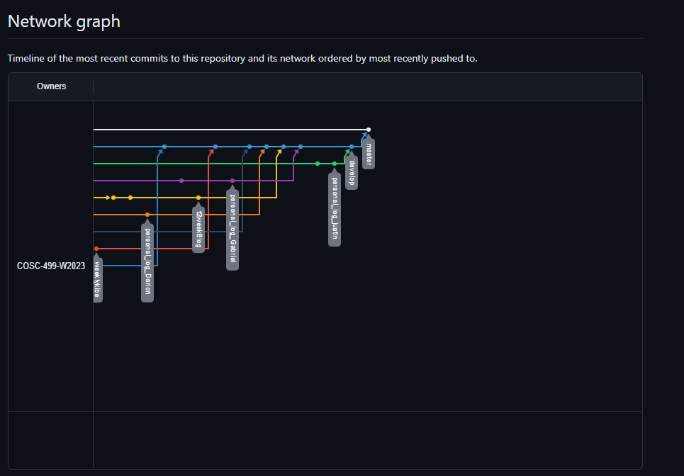

# Team 14 Log - Term 2 - Week 8
- Start Date: February 26
- End Date: March 3

## Milestone Goals:
- In preperation for the upcoming peer testing session, this week our team worked on additional features and improvements such as: adding the ability to access the options menu from within the in-game pause menu, implementing 4 new difficulties (easy, medium, hard, madness), additionally we rebalanced certain player and enemy mechanics such as shooting speed and movement speed, added a boss healthbar for the new miniboss enemy encounter, began creating additional levels, added an item shop for the in-game abilities, spikes which damage the player when walked over, and various bug fixes. These additional features and quality of life improvements were partially based on player feedback and we look forward to additional feedback in the upcoming session. We have also added additional unit testing for existing features. 

## Associated Board Tasks
- Add functionality for spikes which damage player when walked over
- Meet with team and ensure groups preparedness for upcoming peer testing
- Add options menu accessible from pause menu inside the game scene
- Implement functionality for the four difficulties
- Rebalanced players and enemies
- Begin creating additional levels
- Various bug fixes
- Add mini-boss healthbar to UI during mini-boss encounter
- Add additional unit tests for miniboss health system/healthbar
- Add in-game item shop
- Add pop-ups which appear when player approaches items in the item shop

## Burnup Chart

## Network Graph

## Quick Reminder of Student Name → Username
- Jesse Lazzari → @jesselazzari
- Darion Pescada → @dpescada
- Gabriel Mercier → @guabo
- Kibele Sebnem Yildirim → @kibelesebnemyildirim
- Justin Mckendry → @justinmdry

## Completed Tasks
- Added spikes 
- Finished task list for upcoming peer testing session
- Added options menu accessible from pause menu inside the game scene
- Added 4 new difficulties (easy, medium, hard, madness) now accessible from main menu
- Fixed bugs
- Mini-boss healthbar
- Added item shop
- Added item shop pop-ups
- Added new levels

## In Progress Tasks
- In progress tasks are adding additional levels prior to upcoming peer testing session and ensuring that the game can be completed within the allotted session time (20 minutes). 

## Test Report 
### [Test Report Documentation Link](../../tests/Test_log.md)
