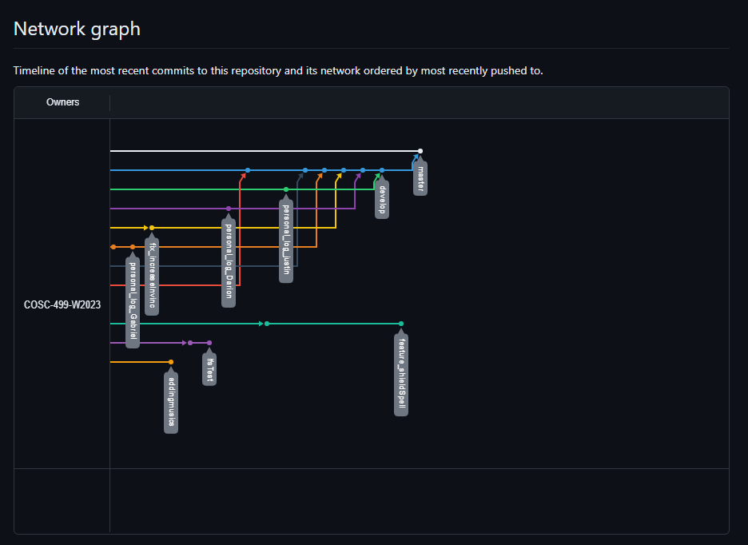

# Team 14 Log - Term 2 - Week 9
- Start Date: March 4
- End Date: March 10

## Milestone Goals:
- The second peer testing session was a great success and allowed us to gather more feedback about the game! We've compiled relevant constructive feedback below, and we aim to improve upon the game by adding these feedback points. Additionally, our team worked on various bug fixes and game features such as new levels with much more variety in level design, additional abilities, updated sprites, and re-balanced certain existing gameplay mechanics prior to the second peer testing session. As we work towards the next milestone, we plan on continuing to test out different values for certain gameplay aspects such as player/enemy health and ability cooldowns to see what works best. 

## Associated Board Tasks
- Various bug fixes relating to existing features
- Test and modify ability cooldowns and health values
- Add music to main menu, regular levels, and boss levels
- Add functionality to modify music volume from options menu
- Add item shop
- Add new ability to summon AI bot to fight along side you
- Update item and spell sprites
- Begin working on final boss animations and scripts
- Create new levels
- Improve spell prompts

## Burnup Chart

## Network Graph

## Quick Reminder of Student Name → Username
- Jesse Lazzari → @jesselazzari
- Darion Pescada → @dpescada
- Gabriel Mercier → @guabo
- Kibele Sebnem Yildirim → @kibelesebnemyildirim
- Justin Mckendry → @justinmdry

## Peer Testing #2 Gameplay Feedback Suggestions
- Hold down trigger to shoot
- Re-balance HP
- Sound effect for picking up spells
- Sound effect for fireball explosions
- Increase invincibility time after getting hit
- Indication on player for spell cooldown
- Increase fire rate
- Too many bullets in easy difficulty

## Completed Tasks
- Bug fixes relating to abilities and mini-boss
- Added music to main menu and regular levels
- Added item shop with improved spell prompts
- Added new summon friendly bot ability

## In Progress Tasks
- Continue working on the final boss which will have multiple different attacks
- Finalize shield ability
- Add more levels
- Additional re-balancing for difficulties
- Implement peer testing suggestions

## Test Report 
### [Test Report Documentation Link](../../tests/Test_log.md)
