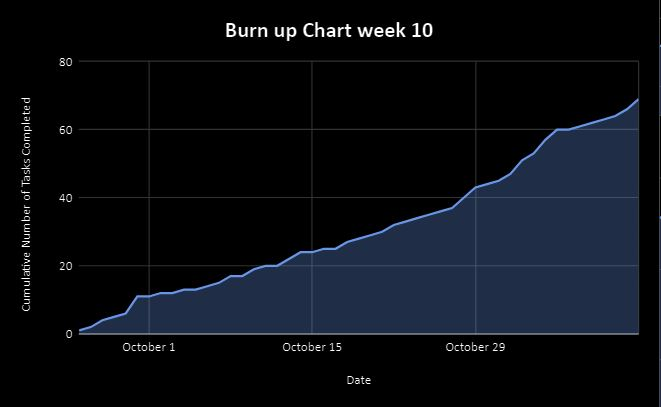
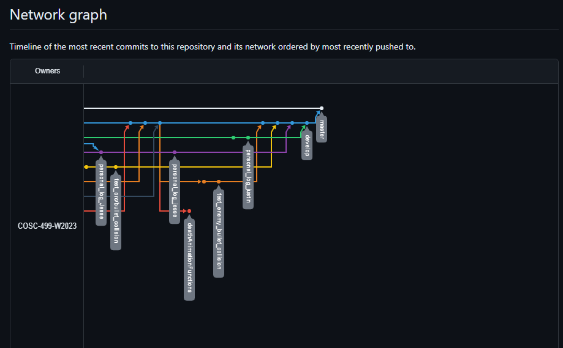

# Team 14 Log - Week 10
- Start Date: November 6
- End Date: November 12

## Milestone Goals:
- For this week we set out to complete additional features for the next upcoming milestone, such as improved enemy targeting and shooting, enemy path-finding, collisions between player and enemy bullets with correct animations, player UI, and a Game Over menu. 

## Associated Board Tasks
- UI for both players
- Enemy Attacks
- Enemy Targeting
- UI unit test
- Game over menu
- Enemy bullet collision with player hit animations
- Individual logs (w/ evals)
- Burnup chart for team log
- Team log

## Burnup Chart

## Network Graph

## Quick Reminder of Student Name → Username
- Jesse Lazzari → @jesselazzari
- Darion Pescada → @dpescada
- Gabriel Mercier → @guabo
- Kibele Sebnem Yildirim → @kibelesebnemyildirim
- Justin Mckendry → @justinmdry

## Completed Tasks
- Added UI for both players
- Added Enemy Attacks
- Added Enemy Targeting
- Added UI unit test
- Added Game over menu
- Added Enemy bullet collisions with player hit animations
- Added Individual logs (w/ evals)
- Added Burnup chart for week 10 team log
- Added Week 10 Team log

## In Progress Tasks
- Host game on website via WebGL or Itch.io
- Player and Enemy death animations and functionality to switch to game over screen

## Test Report 
### [Milestone 1 - Test Report Documentation Link](../../tests/Test_log.md)
