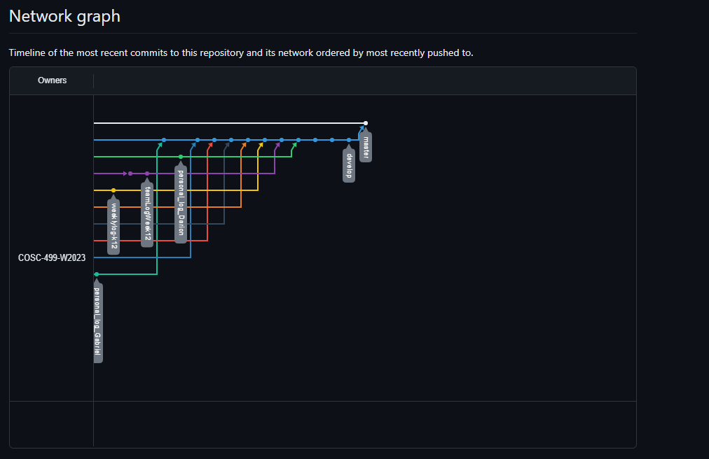

# Team 14 Log - Week 12
- Start Date: November 20
- End Date: November 26

## Milestone Goals:
- For this week we set out to complete additional features and gameplay mechanics for the next upcoming milestone, such as adding a ladder and portal for the player to enter the next level, adjustments to the bullet collision script so that bullets destroy each other when colliding, additional changes to player and enemy animations, additional unit testing for new features, updates to the game over menu, adjustments to player health script, adding an enemy health system script, transitions between levels, 3 new test levels, and hosting the game on website via WebGL or Itch.io. 

## Associated Board Tasks
- Host the game on a website via Itch.io 
- Added Portal and Ladder to Transition Between Levels
- Changes to Bullet Collisions
- Additional Animations and Adjustements to Animator Tree
- Added Unit tests For New Features
- Gameover Menu Updates
- Enemy to player collisions, where player takes damage if enemy walks into them 
- Added level transitions
- Added Test levels
- Individual logs (w/ evals)
- Add Burnup chart for team log
- Write Team log

## Burnup Chart

## Network Graph

## Quick Reminder of Student Name → Username
- Jesse Lazzari → @jesselazzari
- Darion Pescada → @dpescada
- Gabriel Mercier → @guabo
- Kibele Sebnem Yildirim → @kibelesebnemyildirim
- Justin Mckendry → @justinmdry

## Completed Tasks
- Host the game on a website via Itch.io  
- Added Portal and Ladder to Transition Between Levels
- Changes to Bullet Collisions
- Additional Animations and Adjustements to Animator Tree
- Added Unit tests For New Features
- Gameover Menu Updates
- Enemy to player collisions, where player takes damage if enemy walks into them 
- Added level transitions
- Added Test levels
- Individual logs (w/ evals)
- Add Burnup chart for team log
- Write Team log

## In Progress Tasks
- Begin working on the upcoming design document and video demo.
- Additional Unit Testing for Above Features

## Test Report 
### [Milestone 2 - Test Report Documentation Link](../../tests/Test_log.md)
