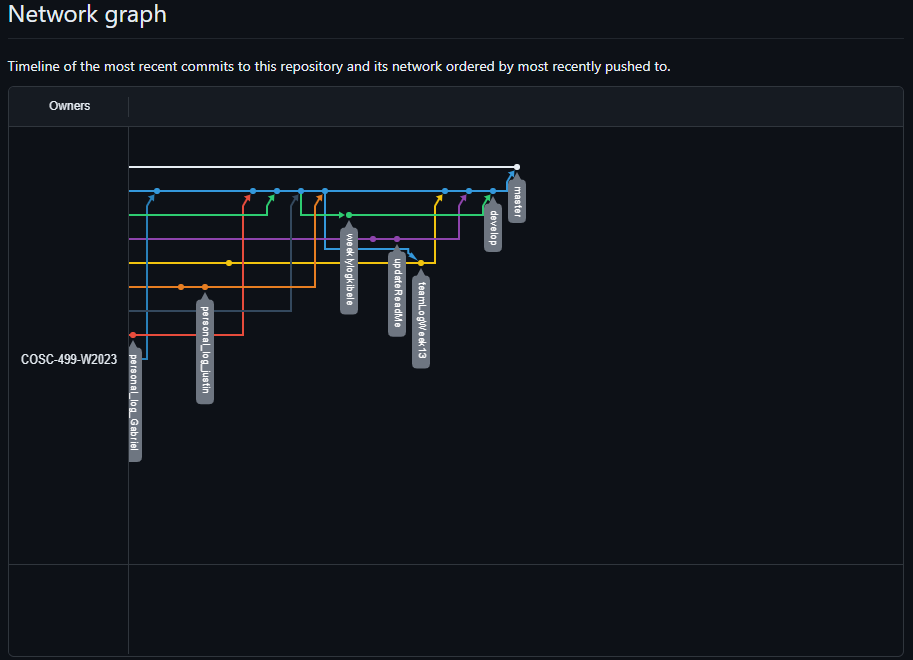

# Team 14 Log - Week 13
- Start Date: November 27
- End Date: December 3

## Milestone Goals:
- This week our team worked on additional features such as adjustments to player death animations and making players/enemies transparent when dead, hosted the game on a webpage, added the level count to the player UI, created our design document including the System Architecture Design, Database Design, and User Interface Design diagrams. Additionally, our team worked on recording our game's video demo, and editing the video to ensure it is under 5 minutes. We also finalized the functionality for the game over menu which checks if all players are dead and added additional unit testing for current features. 

## Associated Board Tasks
- Bug fixes
- Adjust player death animation
- Host Game on the web
- UI for level count
- Design video
- Design Document
- Gameover menu functionality
- Additional Unit tests
- Team log
- Individual logs (w/ evals)
- Burnup chart for team log

## Burnup Chart

## Network Graph

## Quick Reminder of Student Name → Username
- Jesse Lazzari → @jesselazzari
- Darion Pescada → @dpescada
- Gabriel Mercier → @guabo
- Kibele Sebnem Yildirim → @kibelesebnemyildirim
- Justin Mckendry → @justinmdry

## Completed Tasks
- Adjust player death animation
- Host Game on the web
- UI for level count
- Design video
- Design Document
- Gameover menu functionality
- Additional Unit tests
- Team log
- Individual logs (w/ evals)
- Burnup chart for team log

## [Design Video Demo Link](https://youtu.be/Ku38HL_pKv4)

## In Progress Tasks
- Begin working on features for next milestone such as player abilities and additional menu options

## Updated Test Report 
### [Milestone 2 - Test Report Documentation Link](../../tests/Test_log.md)
