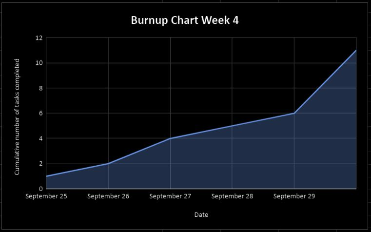
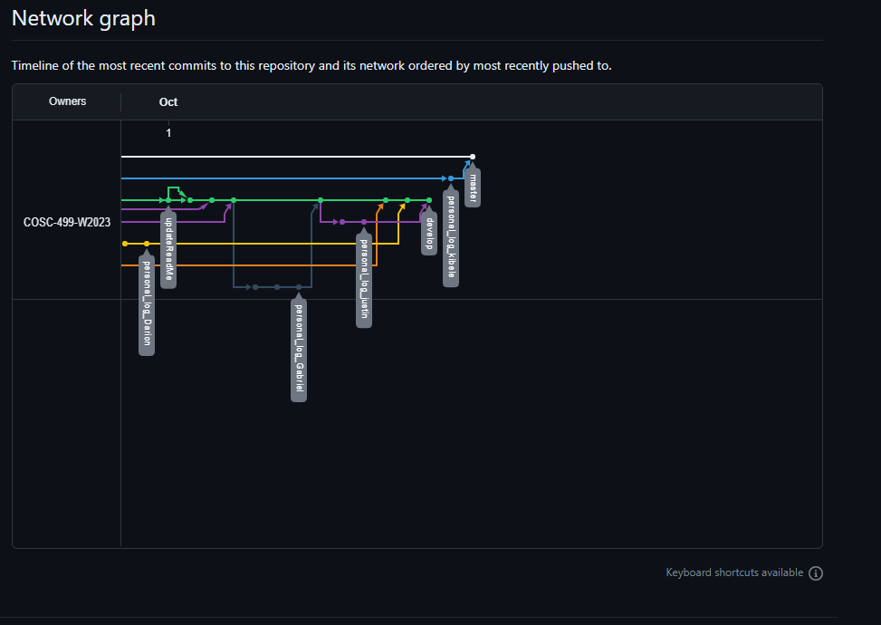

# Team 14 Log - Week 4
- Start Date: September 25
- End Date: October 1

## Milestone Goals:
- The goal of this milestone was to complete our project plan, update our repositorie's README, and setup our Kanban board for task organization. In our project plan we outline the overview of our minimum viable product, outlined our product features, listed stretch goal features, explained our envisioned usage with user scenarios, described our expected deliverables for each milestone deadline, identified our technology stack, and distributed these tasks between team members.  

## Associated Board Tasks
- Complete project plan 1.0 Jesse and Kibele
- Complete project plan 1.1
- Complete project plan 2.0
- Complete project plan 3.0
- Complete project plan 4.0 
- Finalize project plan
- Update readme
- Complete peer evalulations
- Complete Individual logs
- Burnup chart and Network chart for team log 
- Kanban feature board setup in Trello

## Burnup Chart

## Network Graph

## Quick Reminder of Student Name → Username
- Jesse Lazzari → @jesselazzari
- Darion Pescada → @dpescada
- Gabriel Mercier → @guabo
- Kibele Sebnem Yildirim → @kibelesebnemyildirim
- Justin Mckendry → @justinmdry

## Completed Tasks
- Finish project plan
- Update readme
- Submit Team log
- Complete peer evalulations
- Complete Individual logs
- Burnup chart for team log
- Add Network chart
- Kanban feature board setup in Trello

## In Progress Tasks
- Capstone Project Repository Setup

## Test Report 
- Not applicable for this week, since this week's focus involved submitting our team's project plan.
