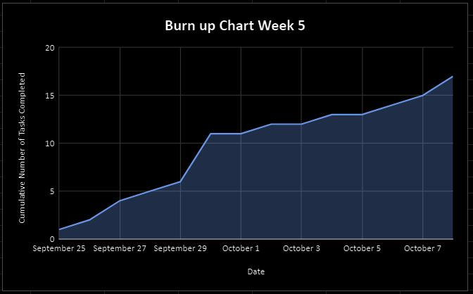
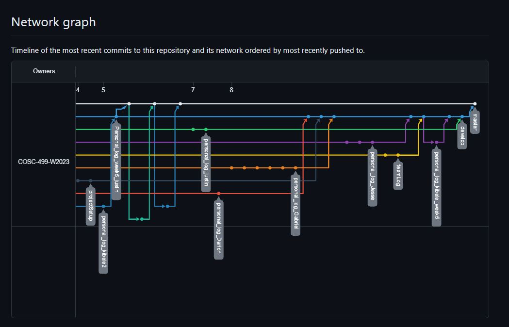

# Team 14 Log - Week 5
- Start Date: October 2
- End Date: October 8

## Milestone Goals:
- For this weekly milestone, our team aimed to establish the foundational framework for our Unity project, acquainted ourselves with the project's tech stack, and complete Unity tutorials to gain proficiency with the engine, especially for team members who are new to its usage. Additionally, we have initiated the Unity project on GitHub, encompassing tasks such as structuring the Unity file hierarchy, importing art assets, configuring the testing framework, establishing a comprehensive .gitignore file, and implementing Git LFS to accommodate large file uploads on GitHub.

## Associated Board Tasks
- Discuss week plan w/ team
- Install Unity and its required software
- Watch/read tutorial(s) to prepare for future milestones
- Complete weekly checkpoint tasks (personal log, team log and weekly peer evaluation)

## Burnup Chart

## Network Graph

## Quick Reminder of Student Name → Username
- Jesse Lazzari → @jesselazzari
- Darion Pescada → @dpescada
- Gabriel Mercier → @guabo
- Kibele Sebnem Yildirim → @kibelesebnemyildirim
- Justin Mckendry → @justinmdry

## Completed Tasks
- We have completed all associated board tasks outlined above. 

## In Progress Tasks
Develop features for year long project plan outlined in upcoming mini presentation milestone (Week 9)
- Player controls (getting user inputs)
- Controller support
- Player movement
- Player attacks
- Player bullets
- Player collisions with other objects
- Player animations (walking, attacking, dying)

Additionally, we will create:
- The level template that will be used in the future for creating other levels
- The main menu
- The pause menu

## Test Report 
- Not applicable for this week, since this week's focus involved setting up the Unity project and having everyone become more familiar with the Unity engine and its associated programs. 
