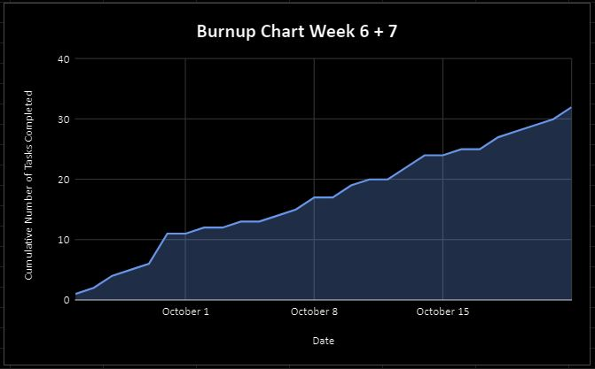
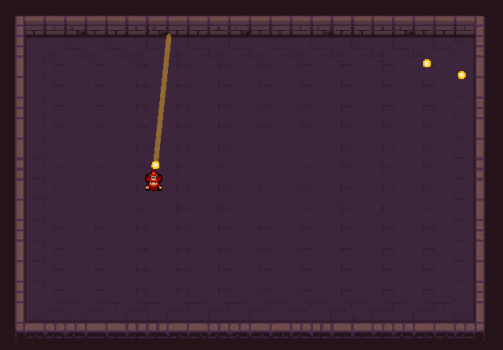

# Team 14 Log - Week 6 and 7
- Start Date: October 9
- End Date: October 22

## Milestone Goals:
- For the first milestone, we plan to have a basic implementation of the player character, and complete the features that were in progress from the previous weekly check-in. At the end of this milestone, we aim to have a simple prototype where you can start a game from the main menu, move around as the player in the level template with working animations, aim using mouse position or controller input, shoot bullets, and pause the game. 

## Associated Board Tasks
- Player controls (getting user inputs from the keyboard)
- Controller support
- Player movement
- Player attacks
- Player bullets
- Player collisions with other objects
- Player animations for Player 1 Red mage (walking, attacking, dying)
- Player animations for Player 2 Cyan mage (walking, attacking, dying)
- Create The level template that will be used in the future for creating other levels
- Create The main menu 
- Create The pause menu
- Player aim using player mouse input, or input from controller with line of sight for player

## Burnup Chart

## Network Graph

## Quick Reminder of Student Name → Username
- Jesse Lazzari → @jesselazzari
- Darion Pescada → @dpescada
- Gabriel Mercier → @guabo
- Kibele Sebnem Yildirim → @kibelesebnemyildirim
- Justin Mckendry → @justinmdry

## Completed Tasks
- Player controls (getting user inputs)
- Controller support
- Player movement
- Player attacks
- Player bullets
- Player collisions with other objects
- Player animations for Player 1 Red mage (walking, attacking, dying)
- Player animations for Player 2 Cyan mage (walking, attacking, dying)
- The level template that will be used in the future for creating other levels
- Player aim using player mouse input, or input from controller with line of sight for player

## Screenshot of Game

## In Progress Tasks
- Create The main menu 
- Create The pause menu
- Create unit tests for the features above
- Create test report
- Mini presentation power point

## Test Report 
- The test report for this week in currently in backlog, since we prioritized implementing the features first. For the following week we aim to complete the unit tests for the features above and finalize a deliverable test report for this upcoming milestone.
