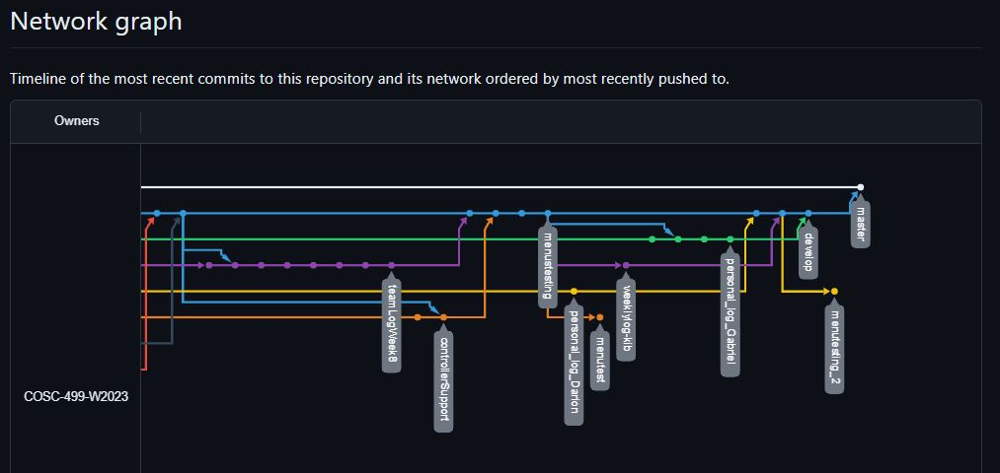
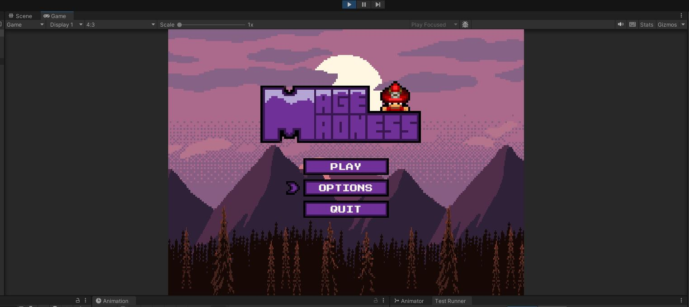

# Team 14 Log - Week 8
- Start Date: October 23
- End Date: October 29

## Milestone Goals:
- For this week, we set out to learn the NUnit testing framework for implementing automated testing in Unity for each feature we have implemented thus far. Additionally, we aimed to improve the functionality of the first draft of the main menu and added controller support using Unity's new Input System. At the end of this milestone, we aim to have unit testing finished for each associated feature implemented so far and refine our features for the live demo mini-presentation. As well as have a good idea of how we will allocate time for the 5 minute mini-presenstion. We have also designed a logo for our game. 

## Associated Board Tasks
- Unit testing for player attack 
- Unit testing for player controls 
- Unit testing for player animation 
- Unit testing for player collision 
- Unit testing for bullet collision 
- Revamp main menu and add controller support
- Unit testing for main menu
- Create logo for main menu
- Document test report
- Update Individual logs (w/ evals)
- Add Burnup chart for team log
- Update Team log
- Prepare for mini presentation and live demo

## Burnup Chart

## Network Graph

## Quick Reminder of Student Name → Username
- Jesse Lazzari → @jesselazzari
- Darion Pescada → @dpescada
- Gabriel Mercier → @guabo
- Kibele Sebnem Yildirim → @kibelesebnemyildirim
- Justin Mckendry → @justinmdry

## Completed Tasks
- Unit testing for player attack 
- Unit testing for player controls 
- Unit testing for player animation 
- Unit testing for player collision 
- Unit testing for bullet collision 
- Update main menu
- Create logo for main menu
- Document test report
- Update Individual logs (w/ evals)
- Add Burnup chart for team log
- Update Team log

## Screenshots of Updated Menu and Game

## In Progress Tasks
- Continue to prepare for mini presentation
- Unit testing for main menu

## Test Report 
### [Milestone 1 - Test Report Documentation Link](../../tests/Test_log.md)

