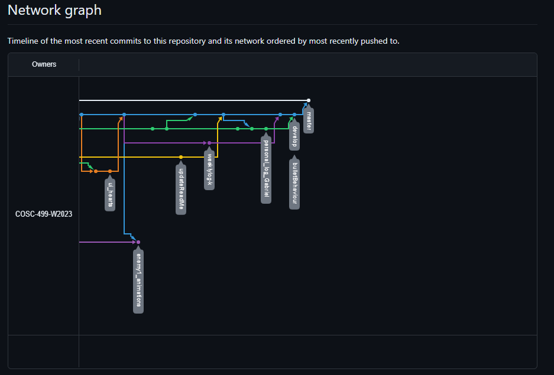

# Team 14 Log - Week 9
- Start Date: October 30
- End Date: November 5

## Milestone Goals:
- For this week we set out to complete all needed functionality and unit testing in time for Thursday's mini-presentation. Additionally, we have gone ahead and added co-op functionality for 2 players and continue to work on additional gameplay mechanic features for the next upcoming milestone such as enemy 1's movement, attacks, bullets,collisions, targeting, animations, collisions between players and enemies, collisions between player bullets and enemies, and collisions between enemy bullets and players. Overall, we are very happy with how the presentation went and look forward to showing the rest of the class more progress on the game as we continue to work on more features! 

## Associated Board Tasks
- Add options menu
- Add 1 or 2 player selection menu
- Add Enemy prefab
- Add Enemy bullet prefab
- Add 2 player co-op functionality 
- Add enemy 1 animations for directional idle 
- Add enemy 1 animations for directional walking
- Add hit and death animations
- Add unit testing for options menu
- Add unit testing for main menu 
- Add unit testing for 2 player co-op
- Add functionality for enemy bullets to bounce off walls

## Burnup Chart

## Network Graph

## Quick Reminder of Student Name → Username
- Jesse Lazzari → @jesselazzari
- Darion Pescada → @dpescada
- Gabriel Mercier → @guabo
- Kibele Sebnem Yildirim → @kibelesebnemyildirim
- Justin Mckendry → @justinmdry

## Completed Tasks
- Added options menu
- Added 1 or 2 player selection menu
- Enemy prefab
- Enemy bullet prefab
- Added 2 player co-op functionality
- Added enemy 1 animations for directional idle
- Added enemy 1 animations for directional walking
- Added hit and death animations
- Added unit testing for options menu
- Added unit testing for main menu
- Added unit testing for 2 player co-op
- Added functionality for enemy bullets to bounce off walls

## Screenshots of Updated Menu and Game

## In Progress Tasks
- Add game over screen
- Add functionality for enemy collisions between players, bullets, and players
- Additional Unit testing for newly completed features
- In game UI for player 1 and player 2 with health points

## Test Report 
### [Milestone 1 - Test Report Documentation Link](../../tests/Test_log.md)

