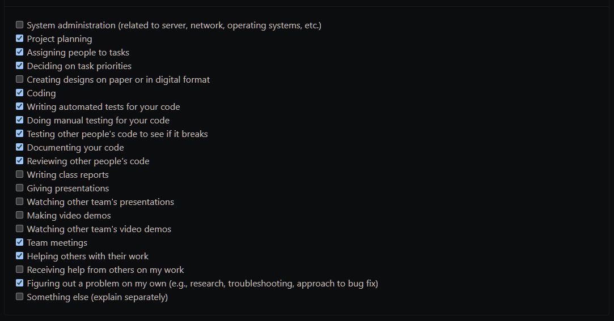
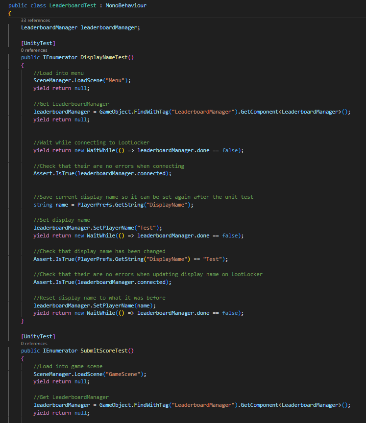
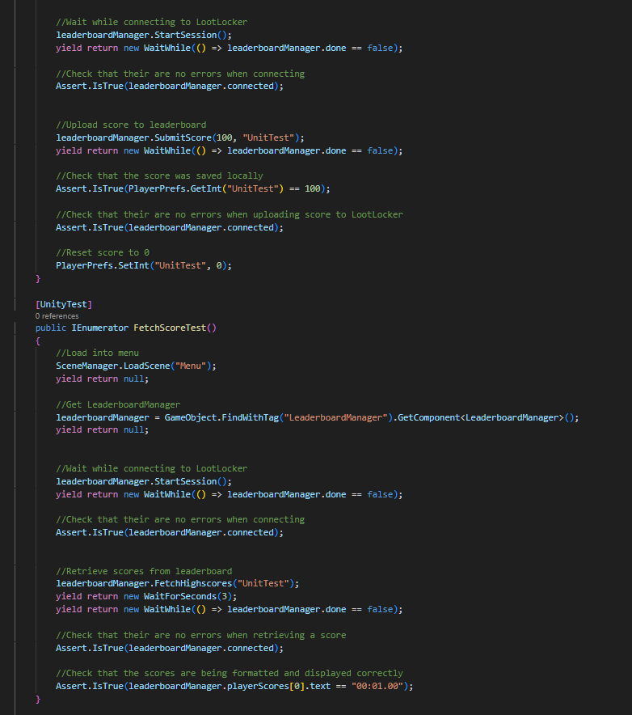
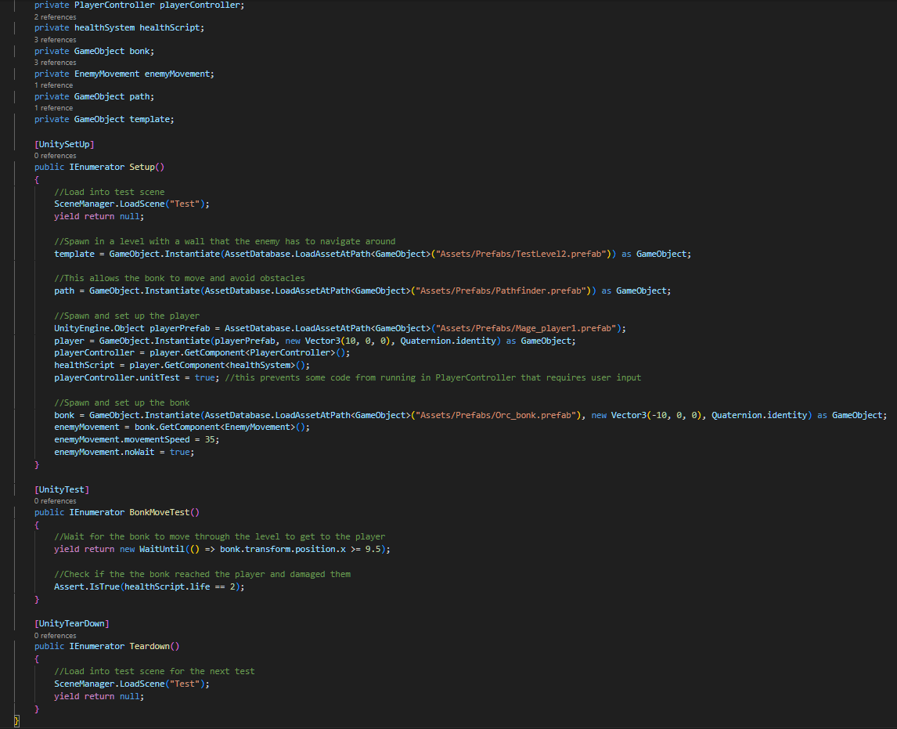
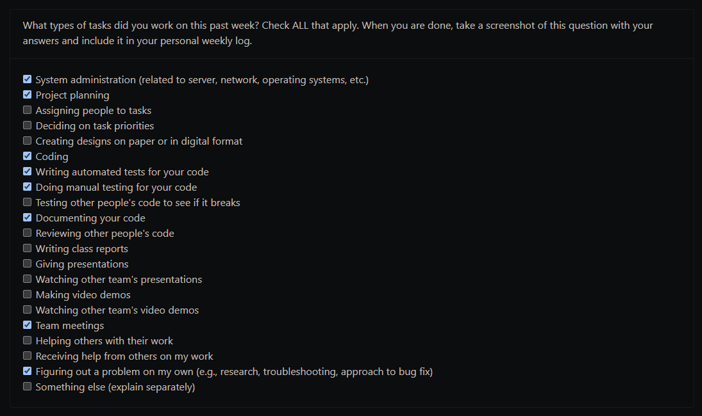
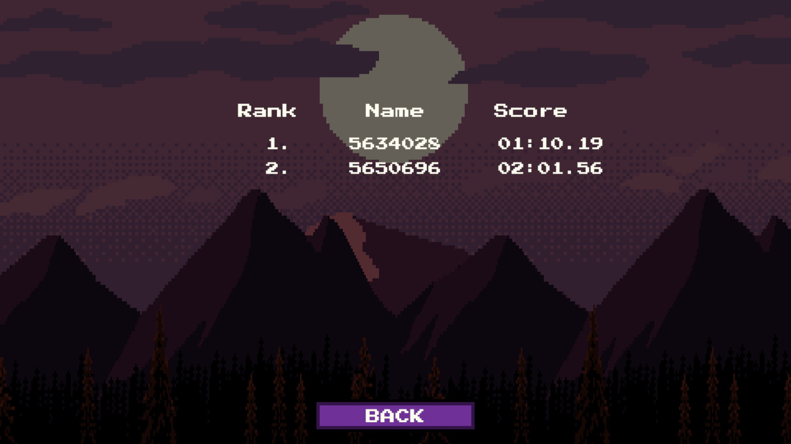
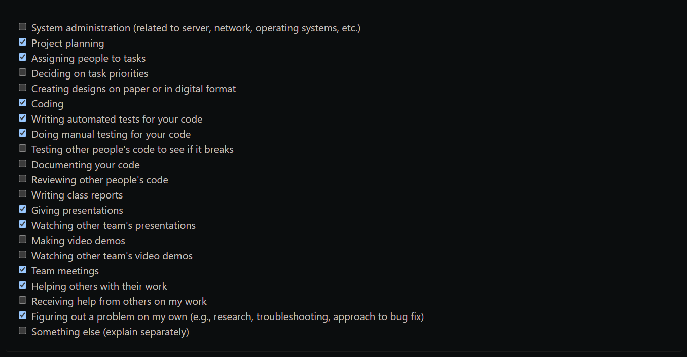
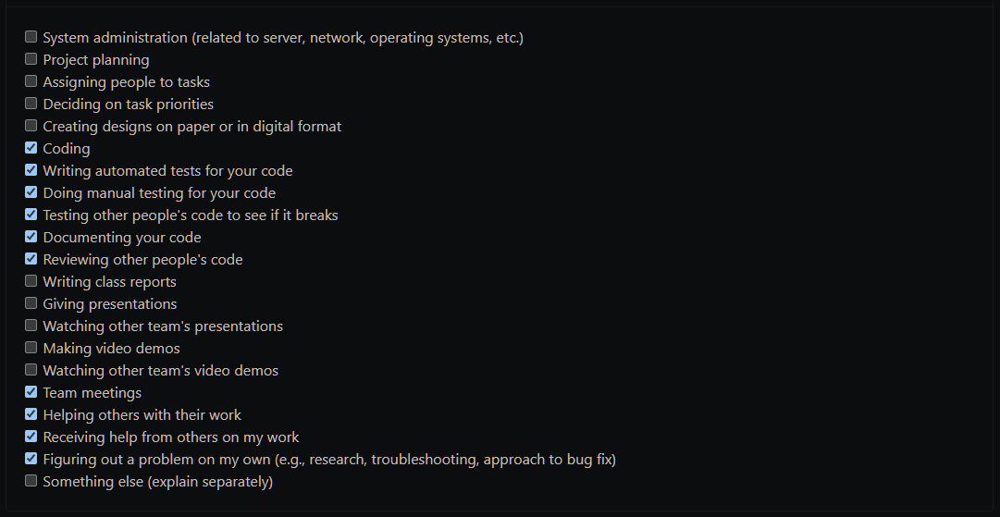
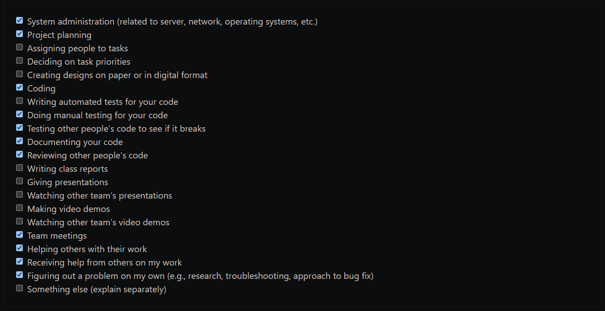
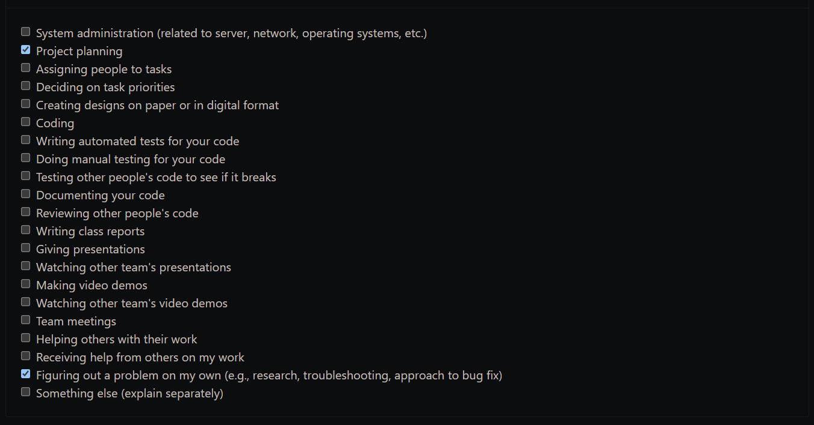

# Personal Log - Darion Pescada

## Term 2 Week 2
- Start Date: January 15
- End Date: January 21

### Tasks I worked on:

  
### Recap on your week's goals
This week, my goal was to finish the online leaderboards for our game and to meet with the team to discuss the current state of the project as well as our future plans. 

### Which features were yours in the project plan for this milestone?
- created leaderboards for each difficulty, and for 1 and 2 players
- improved leaderboard script to upload score to correct leaderboard depending on the difficulty and amount of players
- added filter buttons in leaderboard menu so users can select which leaderboard they want to view and display their score or the top scores
- improved the options menu and added an input field for users to enter a display name
- created functions to update users display name and highlight their name on the leaderboards
- added a function to locally save leaderboard scores
- improved and added more unit tests

Additionally, I improved and added new features to the enemy pathfinding:
- recreated the enemy movement script which now has the option to make enemies either chase after the player, charge at the player periodically, or randomly walk around
- added the movement script to each of the enemies and set them up to behave correctly
- created a function to repeatedly update the pathfinding grid graph so enemies know where they can and cannot go, even if the environment changes
- fixed a bug where the enemies would stop moving before reaching their target position
- added unit tests for the pathfinding/movement of new enemies

### Among these tasks, which have you completed/in progress in the last week?
I have completed all of my tasks for this week and completed a bunch of additional work as well.

### Leaderboard Screenshot

### Leaderboard Unit Test Screenshots

### Enemy Unit Test Screenshots

***

## Term 2 Week 1
- Start Date: January 8
- End Date: January 14

### Tasks I worked on:

  
### Recap on your week's goals
This week, my goal was to start implementing the online leaderboards for our game.

### Which features were yours in the project plan for this milestone?
- installed the LootLocker SDK and set up the online leaderboards
- created functions to submit, retrieve, format, and display leaderboard scores
- added a timer to the game which gets submitted to a leaderboard once all levels are complete
- created the leaderboard menu to display users highscores
- added unit tests for the leaderboard functions I created

### Among these tasks, which have you completed/in progress in the last week?
I have completed all of my tasks for this week as listed above.

### Leaderboard Screenshot

### Unit Test Screenshot

***

## Week 13
- Start Date: November 27
- End Date: December 3

### Tasks I worked on:

  
### Recap on your week's goals
This week, my goals were to create the design document with the team, create unit tests for the transition system, and fix bugs / make improvements to our game.

### Which features were yours in the project plan for this milestone?
Since I have already completed all my features for milestone 2, I decided to focus on making improvements to our game and fixing bugs.
- removed the additional health script from orc prefab causing the transition system to break
- fixed the portal object where it would appear after killing only 1 enemy
- improved the portal object by fixing the collider, making the sprite not blurry, and allowing the players line of sight to go through it
- disabled player bullets colliding with each other
- decreased the width of the players line of sight again
- prevented the players from being able to shoot inside the walls
- improved aiming with controller so there is less jittering
- fixed some unit tests and adjusted some to run faster
- decreased players sorting layer when they die so enemies no longer walk underneath their dead bodies
- fixed a bug where dead enemies would continue playing the walking animation
- added a feature where the players get all their health back after completing a level

Additionally, I created unit tests for the transition system which checks if players are able to transition from one level to the next by using the ladder or portal objects after killing all the enemies.

For the design document, I was responsible for the system architecture portion and the ECS diagram.

### Among these tasks, which have you completed/in progress in the last week?
I have completed all of my tasks for this week as listed above.

### Unit Test Screenshots

***

## Week 12
- Start Date: November 20
- End Date: November 26

### Tasks I worked on:

  
### Recap on your week's goals
- My goals this week were to create unit tests for my milestone 2 features, and to meet with the team to make decisions about some of the features in our game.
- I also wanted to start working on the transition system which is one of my milestone 3 features.

### Which features were yours in the project plan for this milestone?
- My features for this week were to create unit tests for the enemy movement AI and the enemy targeting system.
- Additionally, I created the transition system which moves players from one level to the next, along with some test levels, and a screen fade animation.

### Among these tasks, which have you completed/in progress in the last week?
- This week, I completed all my tasks of creating unit tests and starting on my milestone 3 features. Design document and video demo is in progress. 

***

## Week 10
- Start Date: November 6
- End Date: November 12

### Tasks I worked on:

  
### Recap on your week's goals
- My goals this week were to finish implementing my milestone 2 features.

### Which features were yours in the project plan for this milestone?
- My features for this week were to add the enemy movement AI and to create the enemy targeting system.

### Among these tasks, which have you completed/in progress in the last week?
- This week, I completed all my tasks. Unit testing for enemy movement and enemy targeting are in progress. 

***

## Week 9
- Start Date: October 30
- End Date: November 5

### Tasks I worked on:

  
### Recap on your week's goals
- My goals this week were to meet with the team to plan out and practice our mini presentation, set up a demo of our game for the presentation, and to start working on my milestone 2 features.

### Which features were yours in the project plan for this milestone?
- For milestone 2, my features are to implement local co-op, create the enemy movement AI, and create the enemy targeting AI.

### Among these tasks, which have you completed/in progress in the last week?
- This week, I implemented the co-op feature and I created some unit tests for it as well. The enemy movement and enemy targeting features are in progress, and I plan to complete them throughout the next couple of weeks.

***

## Week 8
- Start Date: October 23
- End Date: October 29

### Tasks I worked on:

  
### Recap on your week's goals
- My goals this week were to test my milestone 1 features, add controller support for the menus, fix bugs, and make other adjustments to improve the quality of our game.

### Which features were yours in the project plan for this milestone?
- This week, I tested my features which include the players ability to shoot, and controller support. I created a unit test for the player attack and thoroughly tested the controller support manually since it is not possible to my knowledge to unit test something that requires physical hardware and user inputs such as controller support.

### Among these tasks, which have you completed/in progress in the last week?
- I completed all my tasks for this week which include testing my features as well as making other improvements to the game such as adding controller support to the menus, reducing the size of the players line of sight, making adjustments to the level template, and redesigning the menus with the help of my team.

***

## Week 6 and 7
- Start Date: October 9
- End Date: October 22

### Tasks I worked on:

  
### Recap on your week's goals
- My goals for the past couple weeks were to implement my milestone 1 features from the project plan, assist our team with their features, and get familiar with Unity's testing framework.

### Which features were yours in the project plan for this milestone?
My features in the project plan for this milestone include:
- giving the player the ability to shoot bullets
- implementing controller support
- Additionally, I added a line of sight to the player for improved aim

### Among these tasks, which have you completed/in progress in the last week?
- I completed all my tasks which were my milestone 1 features as stated above, assisting my team with their milestone 1 features, and learning more about the testing framework.

***

## Week 5
- Start Date: October 2
- End Date: October 8

### Tasks I worked on:

  
### Recap on your week's goals
- My goals this week were to set up the Unity project and prepare for future milestones by familiarizing myself with parts of Unity that I haven't used in a while.

### Which features were yours in the project plan for this milestone?
- My feature was to create and set up the Unity project. This included organizing the file structure in Unity, importing the art assets, setting up the testing framework, adding a proper gitignore file, and adding git lfs for large file uploads to GitHub. I also reviewed how to use certain features in Unity and planned out how I will implement some of my features in future milestones.

### Among these tasks, which have you completed/in progress in the last week?
- I completed all my tasks for this week.

***

## Week 4
- Start Date: September 25
- End Date: October 1

### Tasks I worked on:

  
### Recap on your week's goals
- My goals this week were to meet with our team to decide on all of the features that will be implemented into our game, complete the major milestones part of the project plan, and help our team setup and complete the teamwork distribution feature board.

### Which features were yours in the project plan for this milestone?
- My main feature in the project plan was to complete the major milestones portion. In order to do so, I had to plan out all the features of our game and figure out the most logical order for the features to be implemented. I also helped our team complete the teamwork distribution feature board at the bottom of the project plan.

### Among these tasks, which have you completed/in progress in the last week?
- I completed all my tasks for this week.

***

## Week 3
- Start Date: September 21
- End Date: September 24

### Tasks I worked on:

  
## Recap on your week's goals
- My goals were to familiarize myself with reviewing and creating pull requests, as well as implementing my feature in the exercise.

## Which features were yours in the project plan for this milestone?
- My feature was to implement an array containing all english words that is used to validate that the algorithm returns an english word.

## Among these tasks, which have you completed/in progress in the last week?
- I completed my task and had my branch reviewed, and then merged into the master branch.
