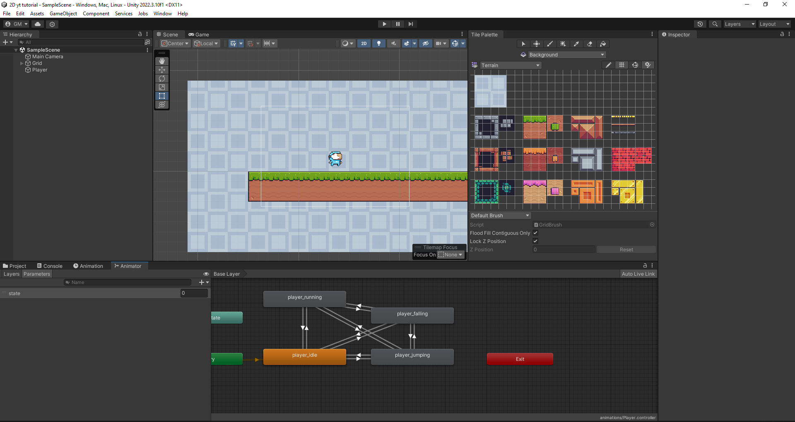
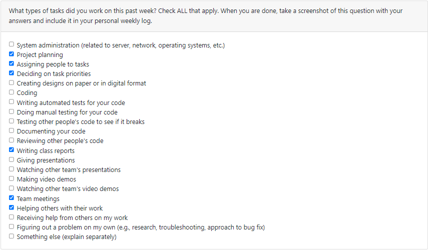

# Personal Log - Gabriel Mercier
## Week 5
- Start Date: October 2
- End Date: October 8

### Tasks I worked on:

  
### Recap on your week's goals
My goals this week were to: 
* Discuss with the team making sure we are on the same page for the track of the project
* Stay on top of my designated tasks/features

### Which features were yours in the project plan for this milestone?
My features this week were to:
* Install Unity and it's respective programs
* Try out unity following a tutorial to prepare for future milestones.
### Among these tasks, which have you completed/in progress in the last week?
I have completed all my tasks. I followed this [tutorial](https://youtu.be/Ii-scMenaOQ?si=fdblajOZv-Tpky3p) on youtube parts 1-6. Below are screenshots of my unity editor and the scripts I wrote alongside.

***

## Week 4
- Start Date: September 25
- End Date: October 1

### Tasks I worked on:

  
### Recap on your week's goals
My goals this week were to: 
* Meet with the team to make sure we were on the same page for the MVP and split up work for the week
* Stay on top of my designated tasks/features

### Which features were yours in the project plan for this milestone?
My features this week were to:
* Create user scenarios for section 1.1 of the Project Plan
* Update our ReadMe file with basic info about the team and project option
* Help with the set up the Trello board
* Help with creating the Burnup Chart
* Work with the team to divvy up the work set out in section 4 of the Project Plan
### Among these tasks, which have you completed/in progress in the last week?
I have completed all my tasks.

***

## Week 3
- Start date: September 21
- End date: September 24

## Tasks I worked on:

  
## Recap on your week's goals
This week's goals for me were to become more comfortable with Github pull requests, merges and branching as well as learning to share workload with my team.

## Which features were yours in the project plan for this milestone?
This week I completed the wordChanger feature on the word chain exercise, a function that takes in a word and replaces a random letter in that word with another.

## Among these tasks, which have you completed/in progress in the last week?
I fully completed my task. 
