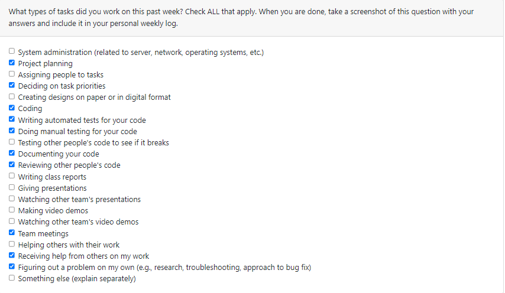
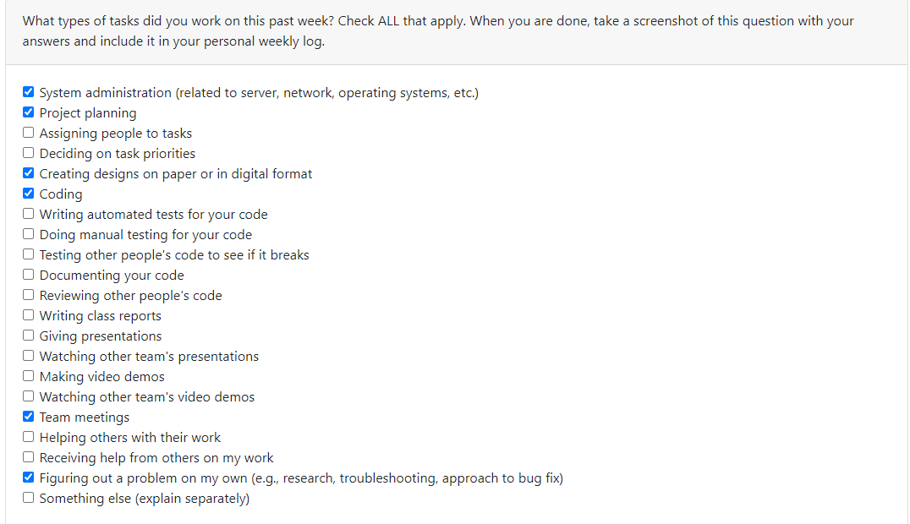

# Personal Log - Gabriel Mercier
## Week 12
- Start Date: November 20
- End Date: November 26
  
### Tasks I worked on:

  
### Recap on your week's goals
My goals this week were to: 
* Stay on top of my features
* Ensure the team had the same vision for the design doc/video
* Improve on minor game adjustments

### Which features were yours in the project plan for this milestone?
My features this week were to:
* Create a portal and portal script for switching levels
* Adjust the enemy health system to accomodate for the use of a portal or a trapdoor/ladder
* Minor adjustments: Make players unable to shoot/remove line of sight once their dead. And remove enemy/player collider once their dead.
### Among these tasks, which have you completed/in progress in the last week?
I completed all my tasks. Unit test for enemy health system script in progress as wells as the Design doc/video.

***
## Week 10
- Start Date: November 6
- End Date: November 12
  
### Tasks I worked on:

  
### Recap on your week's goals
My goals this week were to: 
* Improve on UI
* Experiment on potential feature implementation (level switching)
* Ensure team is on the same page going into reading break

### Which features were yours in the project plan for this milestone?
My features this week were to:
* Improve UI functionality
* Write unit tests for UI
* Work on Enemy Attack feature
### Among these tasks, which have you completed/in progress in the last week?
I completed all my tasks. level switching still in progress along with unit tests.

***
## Week 9
- Start Date: October 30
- End Date: November 5
  
### Tasks I worked on:

  
### Recap on your week's goals
My goals this week were to: 
* Prep for the presentation
* Do the presentation
* Do team evals
* Keep up with meetings

### Which features were yours in the project plan for this milestone?
My features this week were to:
* Work on in-game UI/overlay
* Create a health system
### Among these tasks, which have you completed/in progress in the last week?
Hearts/lives, bullets UI and health system script are completed. Unit testing and adding additional UI elements are still in progress.

***
## Week 8
- Start Date: October 23
- End Date: October 29

### Tasks I worked on:

  
### Recap on your week's goals
My goals this week were to: 
* Make sure the team had similar expectations for the presentation
* Polish and test features 

### Which features were yours in the project plan for this milestone?
My features this week were player control tests:
* moveDirection test: ensure player moves when given input
* aimDirection test: ensure player bullet aims in the direction of input
### Among these tasks, which have you completed/in progress in the last week?
I have completed all my tasks. Still prepping for the mini presentation.

***
## Week 6 + 7
- Start Date: October 9
- End Date: October 22

### Tasks I worked on:

  
### Recap on your week's goals
My goals this week were to: 
* Have the teams work be collaborative
* Stay on top of my designated tasks/features

### Which features were yours in the project plan for this milestone?
My features this week were to:
* Player controls: System detects input from user.
* Player movement: player can move up,down,left,right.
* Player aim: Added the bullet that revolves around the player point to the mouse position
* Assisted with controller support.
### Among these tasks, which have you completed/in progress in the last week?
I have completed all my features. Still working on Unit tests. 

***
## Week 5
- Start Date: October 2
- End Date: October 8

### Tasks I worked on:

  
### Recap on your week's goals
My goals this week were to: 
* Discuss with the team making sure we are on the same page for the track of the project
* Stay on top of my designated tasks/features

### Which features were yours in the project plan for this milestone?
My features this week were to:
* Install Unity and it's respective programs
* Try out unity following a tutorial to prepare for future milestones.
### Among these tasks, which have you completed/in progress in the last week?
I have completed all my tasks. I followed this [tutorial](https://youtu.be/Ii-scMenaOQ?si=fdblajOZv-Tpky3p) on youtube parts 1-6. Below are screenshots of my unity editor and the scripts I wrote alongside.

***

## Week 4
- Start Date: September 25
- End Date: October 1

### Tasks I worked on:

  
### Recap on your week's goals
My goals this week were to: 
* Meet with the team to make sure we were on the same page for the MVP and split up work for the week
* Stay on top of my designated tasks/features

### Which features were yours in the project plan for this milestone?
My features this week were to:
* Create user scenarios for section 1.1 of the Project Plan
* Update our ReadMe file with basic info about the team and project option
* Help with the set up the Trello board
* Help with creating the Burnup Chart
* Work with the team to divvy up the work set out in section 4 of the Project Plan
### Among these tasks, which have you completed/in progress in the last week?
I have completed all my tasks.

***

## Week 3
- Start date: September 21
- End date: September 24

## Tasks I worked on:

  
## Recap on your week's goals
This week's goals for me were to become more comfortable with Github pull requests, merges and branching as well as learning to share workload with my team.

## Which features were yours in the project plan for this milestone?
This week I completed the wordChanger feature on the word chain exercise, a function that takes in a word and replaces a random letter in that word with another.

## Among these tasks, which have you completed/in progress in the last week?
I fully completed my task. 
