# Personal Log - Jesse Lazzari
## Term 2 Week 1
- Start Date: January 8
- End Date: January 14
  
### Tasks I worked on:
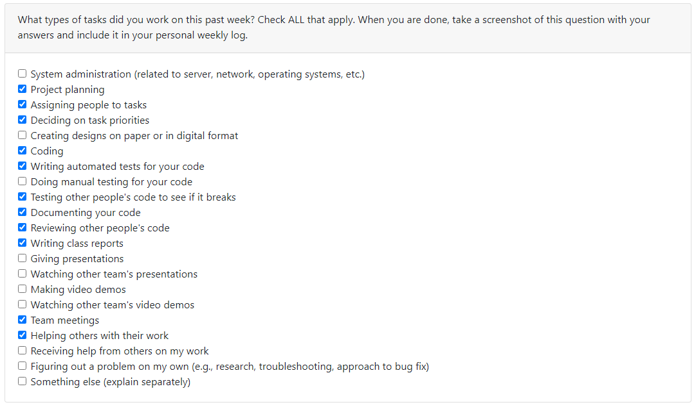
  
### Recap on your week's goals
My goals this week were to: 
* Meet with team and discuss gameplay changes
* Add new enemy (orc soldier) with all associated animations
* Add idle and walking animations for orc soldier in animator tree
* Add hit and death animations with functionality in new enemy health script
* Add unit testing for new orc soldier enemy
* Write team log report

### Which features were yours in the project plan for this milestone?
My features this week were to:
* Add new enemy (orc soldier) with all associated animations
* Add idle and walking animations for orc soldier in animator tree
* Add hit and death animations with functionality in new enemy health script

### Among these tasks, which have you completed/in progress in the last week?
* I have completed the features I set out to implement as outlined above with associated unit tests
* In progress tasks are looking ahead towards the next milestone and begin working on player abilities

## Screenshots of new Orc Soldier Enemy and Animator Tree 
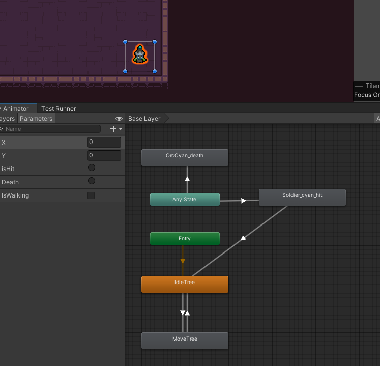

## Screenshot of Unit Test for Orc Soldier 
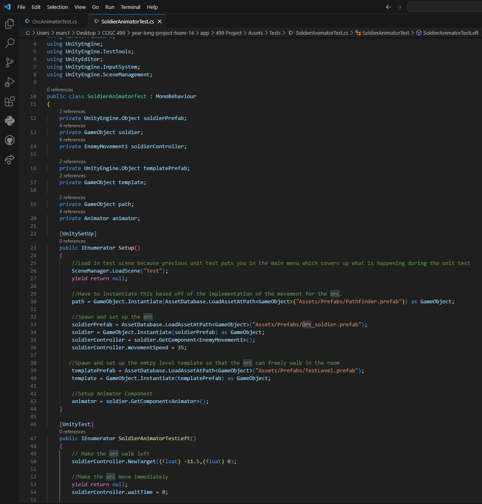

***

## Week 13
- Start Date: November 27
- End Date: December 3
  
### Tasks I worked on:

  
### Recap on your week's goals
My goals this week were to: 
* Compile slide set presentation which discusses design decisions made for 2 features for the design milestone document
* Record video demo presentation which discusses design changes made to the main menu
* Edit full video demo ensuring it is under 5 minutes
* Attend team meetings and plan task division for the design milestone document
* Add feature which makes dead enemies and players transparent
* Add unit tests for orc enemy Animator parameters
* Write weekly teamlog for the team

### Which features were yours in the project plan for this milestone?
My features this week were to:
* Added feature which makes dead enemies and players transparent
* Added unit tests for orc enemy Animator parameters which tests orc enemy walking animations
* Added unit tests for orc enemy death animator trigger

### Among these tasks, which have you completed/in progress in the last week?
* I have completed the features I set out to implement as outlined above with unit testing as well
* In progress tasks are looking ahead towards the next milestone and begin working on player abilities

## Screenshots of Tasks I Worked On

### Screenshot of transparent dead enemy & player
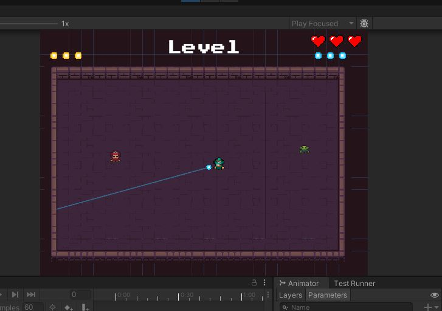
#### Orc Animator Unit Testing

#### Scripts for Transparency applied on Dead Enemies
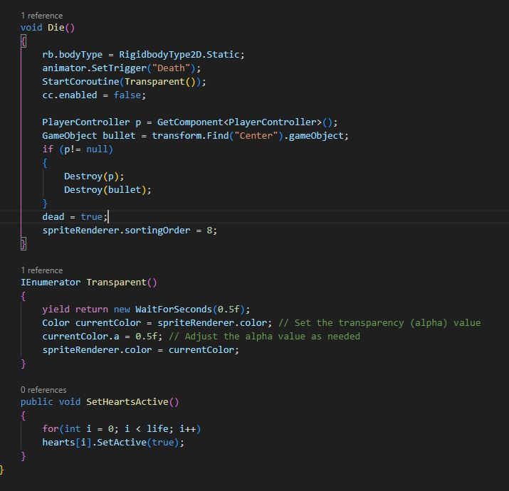
#### Scripts for Transparency applied on Dead Player
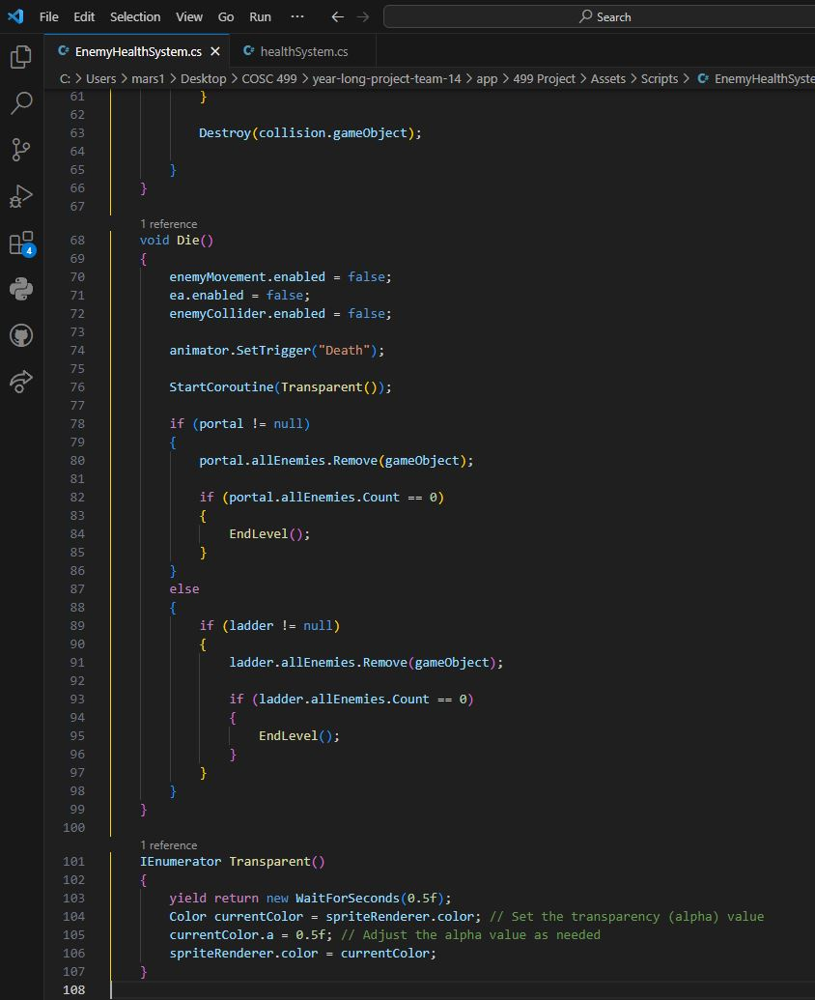

***
## Week 12
- Start Date: November 20
- End Date: November 26
  
### Tasks I worked on:

  
### Recap on your week's goals
My goals this week were to: 
* Ensure I am completing all of my assigned features
* Attend team meetings and provide input on gameplay design decisions
* Test gameplay mechanics and brainstorm with the team how we can balance the game
* Provide feedback on current features and bug fixes related to player/enemy animations
* Write weekly teamlog for the team

### Which features were yours in the project plan for this milestone?
My features this week were to:
* Add health system script for enemies which stores current enemy health, and decrements if enemy is hit
* Add working implementation for playing death animation only when enemy is out of lives
* Adjust the player health system script to trigger death animations if a player runs out of lives
* Re-work animation tree so that once player/enemy is dead they remain static in their dead state in the level
* Adjust enemy movement script to disable pathfinding/walking when enemy is dead

### Among these tasks, which have you completed/in progress in the last week?
* I have completed the features I set out to implement as outlined above:
* In progress tasks are unit testing for features above and begin working on the upcoming design document and video demo.

### Screenshots of Tasks I Worked On

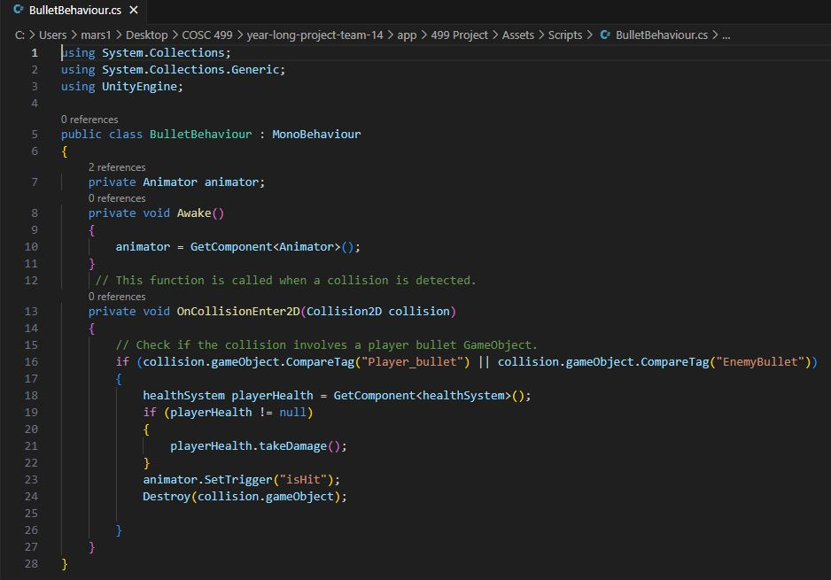

## Week 10
- Start Date: November 6
- End Date: November 12

### Tasks I worked on:

  
### Recap on your week's goals
My goals this week were to: 
* Attend team meetings
* Make sure team is on the same page before reading week begins
* Add functionality for collisions between Player bullets and other Players
* Add functionality for collisions between Player bullets and other Enemies
* Add functionality for collisions between Enemy bullets and Players
* Fix a bug from last week where player hit animation was delayed after colliding with enemy bullets

### Which features were yours in the project plan for this milestone?
My features this week were to:
* Added functionality for collisions between Player bullets and other Players
* Added functionality for collisions between Player bullets and other Enemies
* Added functionality for collisions between Enemy bullets and Players
* Fixed a bug from last week where player hit animation was delayed after colliding with enemy bullets

### Among these tasks, which have you completed/in progress in the last week?
* I have completed the features I set out to implement as outlined above:
* In progress tasks are implementing death animations when player/or enemies have no more lives and unit testing for features above

***

## Week 9
- Start Date: October 30
- End Date: November 5

### Tasks I worked on:

  
### Recap on your week's goals
My goals this week were to: 
* Attend meetings and prepare for mini presentation
* Present mini-demo on Thursday with rest of team
* Complete the required number of evaluations for other teams
* Add directional idle animations for first enemy (Cyan Orc)
* Add directional walking animations for first enemy (Cyan Orc)

### Which features were yours in the project plan for this milestone?
My features this week were to:
* Add directional idle animations for first enemy (Cyan Orc)
* Add directional walking animations for first enemy (Cyan Orc)
* Add hit and death animations for first enemy (Cyan Orc)

### Among these tasks, which have you completed/in progress in the last week?
* I have completed all unit testing for the features I set out to implement:
* Add directional idle animations for first enemy (Cyan Orc)
* Add directional walking animations for first enemy (Cyan Orc)
* Add hit and death animations for first enemy (Cyan Orc)
* In progress tasks are implementing script to play correct hit/death animations when enemy collides with player bullet

### Screenshots of Implemented Unit Testing and New Enemy
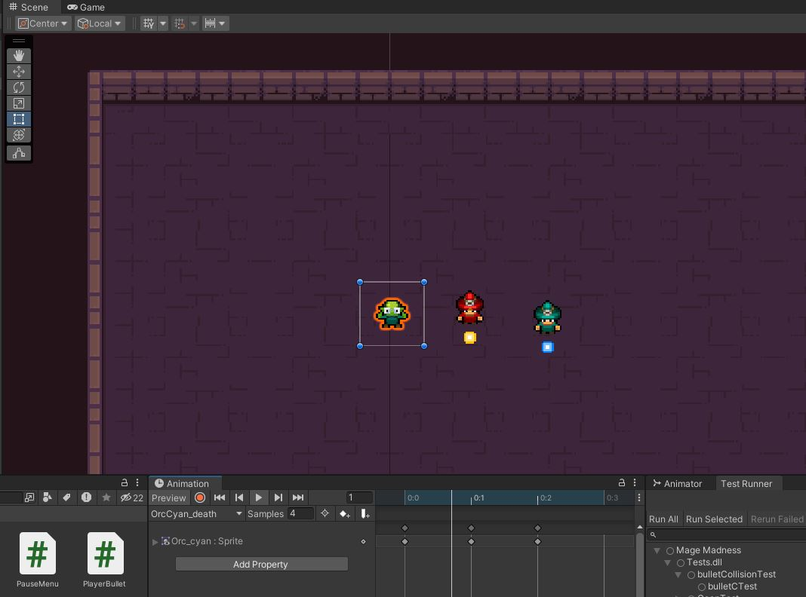

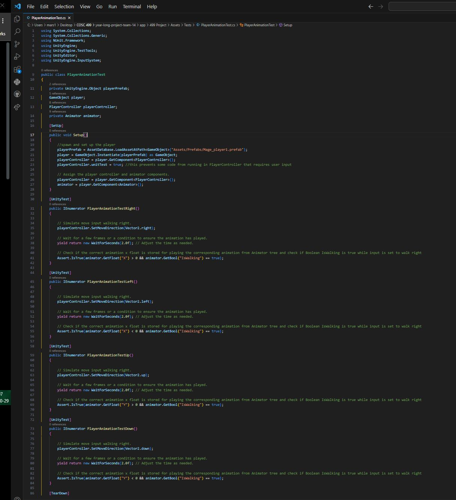

***

## Week 8
- Start Date: October 23
- End Date: October 29

### Tasks I worked on:

  
### Recap on your week's goals
My goals this week were to: 
* Learn Unit Testing Basics (C#, NUnit)
* Implement unit testing for directional player animations and ensure Animator tree is playing correct animation when player is moving
* Prepare for the upcoming mini-presentation
* Write weekly teamlog for the team

### Which features were yours in the project plan for this milestone?
My features this week were to:
* Implement Unit Testing for Player animations for player 1 and player 2 character 
* Implement Unit Testing for playing directional animation based on movement (on key press or joystick direction) for player 1 and 2

### Among these tasks, which have you completed/in progress in the last week?
* I have completed all unit testing for the features I set out to implement
* In progress tasks are continuing to prepare for the upcoming mini-presentation

### Screenshots of Implemented Unit Testing with NUnit

***

## Week 6 and 7
- Start Date: October 9
- End Date: October 22

### Tasks I worked on:

  
### Recap on your week's goals
My goals this week were to: 
* Finalize the level template that will be used in the future for creating other levels
* Implement player directional animations for idle, walking, attacking, and dying for player 1 (red mage)
* Implement player directional animations for idle, walking, attacking, and dying for player 2 (green mage)
* Add functionality for playing character animations and animator tree transitions on either keypress or joystick movement
* Write weekly teamlog for the team

### Which features were yours in the project plan for this milestone?
My features this week were to:
* Default level 1 template setup and design
* Player animations for player 1 character
* Player animations for player 2 character
* Play directional animation based on movement (on key press or joystick direction) for player 1
* Play directional animation based on movement (on key press or joystick direction) for player 2

### Among these tasks, which have you completed/in progress in the last week?
* I have completed all features I set out to implement
* In progress tasks are implementing unit tests for the features above

***

## Week 5
- Start Date: October 2
- End Date: October 8

### Tasks I worked on:
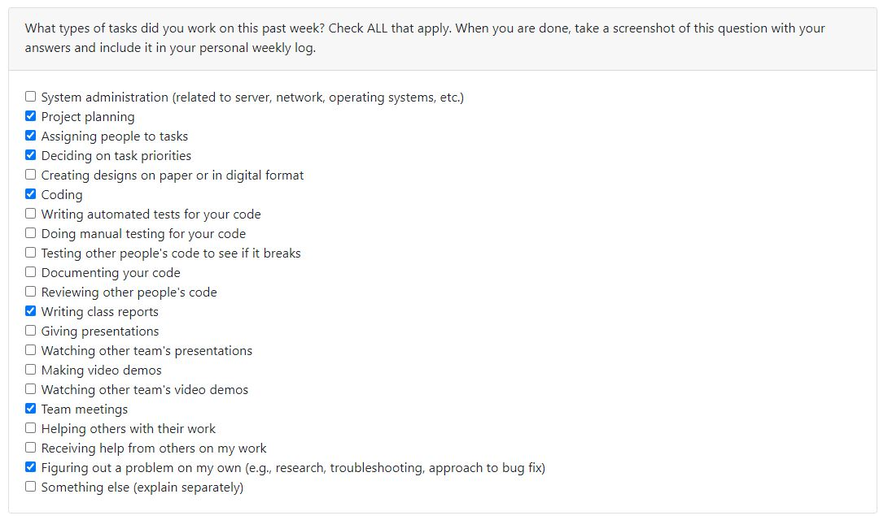
  
### Recap on your week's goals
My goals this week were to: 
* Learn more about the tech stack we will be using for the year long project
* Dicuss with the rest of the team and ensure we are on the same page about the project
* Ensure I completed my designated tasks for this week in a timely manner

### Which features were yours in the project plan for this milestone?
My features this week were to:
* Install Unity and it's respective programs
* Familiarize myself with Unity and learn the basic functionality so I am prepared for the upcoming milestones and able to code my respective features for the year long project.
* Help complete the weekly log for our team

### Among these tasks, which have you completed/in progress in the last week?
* I completed all my designated tasks for this week.
* In order to learn more about the basics of Unity I followed along with this Youtube [tutorial](https://youtu.be/Ii-scMenaOQ?si=fdblajOZv-Tpky3p) and completed videos 1 to 5.
* I have attached a screenshot of my Unity tutorial project below 

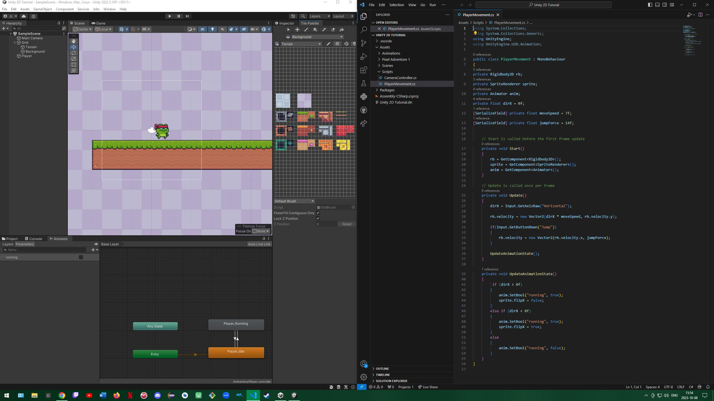

***

## Week 4
- Start Date: September 25
- End Date: October 1

### Tasks I worked on:
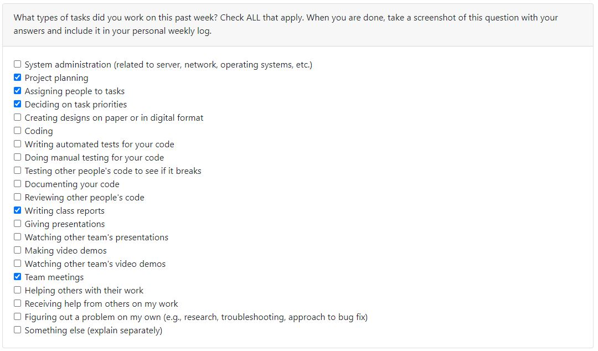
  
### Recap on your week's goals
- My goal for this week was to help complete our team's weekly log, outline our minimum viable product in our project plan, meet with the rest of the team to discuss our product features during meetings, and outline my selected tasks in our project plan's teamwork distribution feature board. 

### Which features were yours in the project plan for this milestone?
- This week I was tasked with aiding the rest of the team in the completion of our project plan by writing the overview of our minimum viable product, helped to create a burnup chart, and setup our weekly team log. 

### Among these tasks, which have you completed/in progress in the last week?
- I have succesfully completed my assigned features for this week. 

***

## Week 3
- Start Date: September 21
- End Date: September 24

### Tasks I worked on:
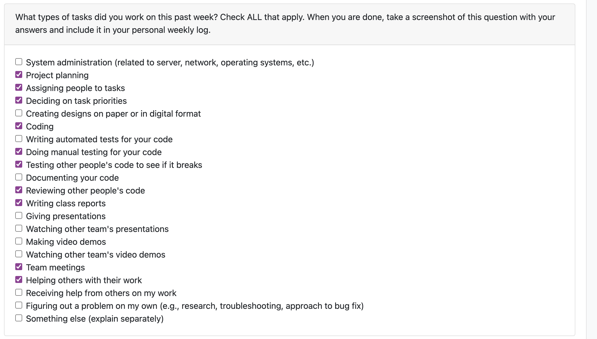
  
### Recap on your week's goals
- My goals for this week was to get more experience working with Git/GitHub branching workflow and aid in completing the word chain exercise.

### Which features were yours in the project plan for this milestone?
- For this exercise I was tasked with implementing the "read input from user with data validation feature"

### Among these tasks, which have you completed/in progress in the last week?
- I have succesfully completed my assigned feature and the feature branch was merged to the master branch. 
