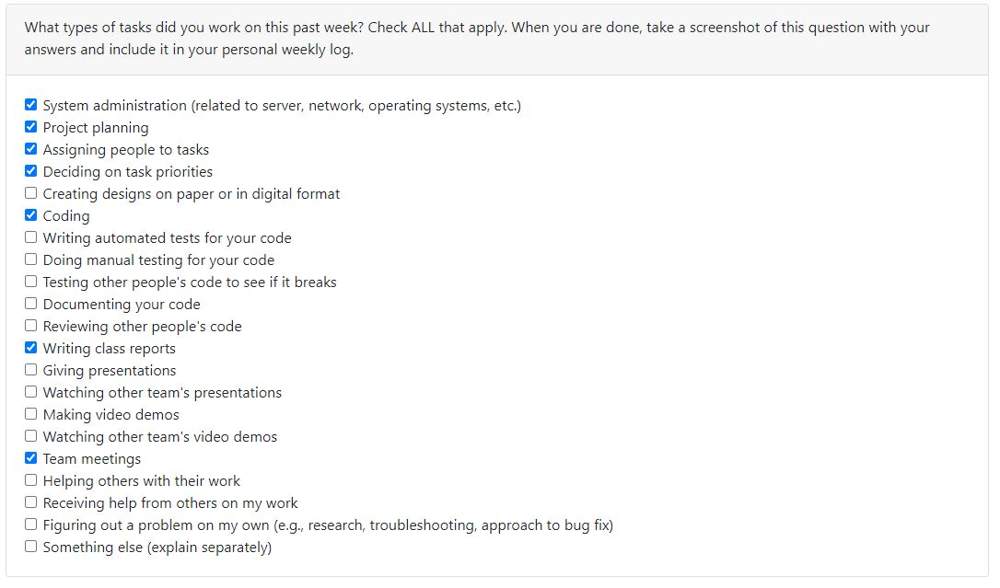

# Personal Log - Jesse Lazzari
## Week 6 and 7
- Start Date: October 9
- End Date: October 22

### Tasks I worked on:

  
### Recap on your week's goals
My goals this week were to: 
* Finalize the level template that will be used in the future for creating other levels
* Implement player directional animations for idle, walking, attacking, and dying for player 1 (red mage)
* Implement player directional animations for idle, walking, attacking, and dying for player 2 (green mage)
* Add functionality for playing character animations and animator tree transitions on either keypress or joystick movement
* Write weekly teamlog for the team

### Which features were yours in the project plan for this milestone?
My features this week were to:
* Default level 1 template setup and design
* Player animations for player 1 character
* Player animations for player 2 character
* Play directional animation based on movement (on key press or joystick direction) for player 1
* Play directional animation based on movement (on key press or joystick direction) for player 2

### Among these tasks, which have you completed/in progress in the last week?
* I have completed all features I set out to implement
* In progress tasks are implementing unit tests for the features above

***

## Week 5
- Start Date: October 2
- End Date: October 8

### Tasks I worked on:

  
### Recap on your week's goals
My goals this week were to: 
* Learn more about the tech stack we will be using for the year long project
* Dicuss with the rest of the team and ensure we are on the same page about the project
* Ensure I completed my designated tasks for this week in a timely manner

### Which features were yours in the project plan for this milestone?
My features this week were to:
* Install Unity and it's respective programs
* Familiarize myself with Unity and learn the basic functionality so I am prepared for the upcoming milestones and able to code my respective features for the year long project.
* Help complete the weekly log for our team

### Among these tasks, which have you completed/in progress in the last week?
* I completed all my designated tasks for this week.
* In order to learn more about the basics of Unity I followed along with this Youtube [tutorial](https://youtu.be/Ii-scMenaOQ?si=fdblajOZv-Tpky3p) and completed videos 1 to 5.
* I have attached a screenshot of my Unity tutorial project below 

***

## Week 4
- Start Date: September 25
- End Date: October 1

### Tasks I worked on:

  
### Recap on your week's goals
- My goal for this week was to help complete our team's weekly log, outline our minimum viable product in our project plan, meet with the rest of the team to discuss our product features during meetings, and outline my selected tasks in our project plan's teamwork distribution feature board. 

### Which features were yours in the project plan for this milestone?
- This week I was tasked with aiding the rest of the team in the completion of our project plan by writing the overview of our minimum viable product, helped to create a burnup chart, and setup our weekly team log. 

### Among these tasks, which have you completed/in progress in the last week?
- I have succesfully completed my assigned features for this week. 

***

## Week 3
- Start Date: September 21
- End Date: September 24

### Tasks I worked on:

  
### Recap on your week's goals
- My goals for this week was to get more experience working with Git/GitHub branching workflow and aid in completing the word chain exercise.

### Which features were yours in the project plan for this milestone?
- For this exercise I was tasked with implementing the "read input from user with data validation feature"

### Among these tasks, which have you completed/in progress in the last week?
- I have succesfully completed my assigned feature and the feature branch was merged to the master branch. 
