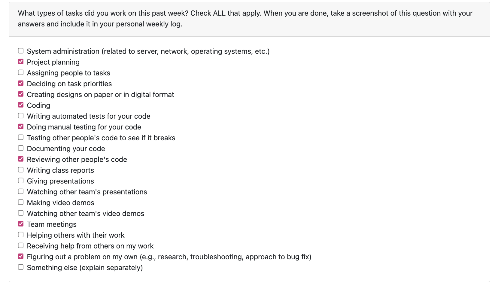
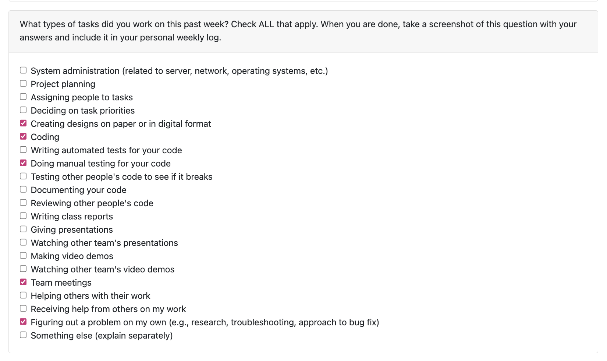
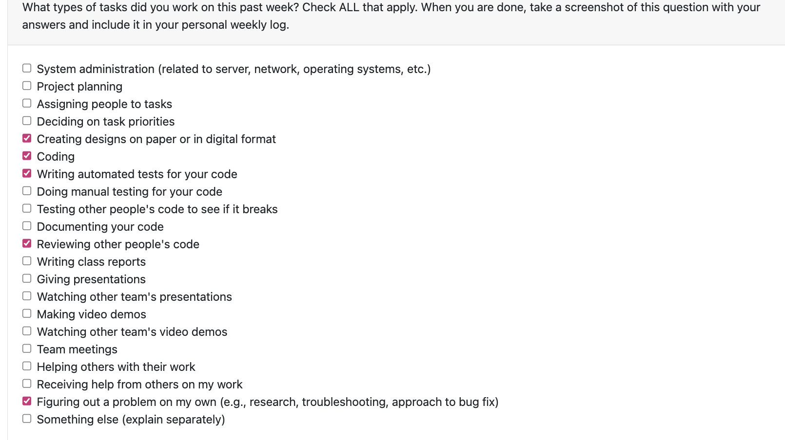
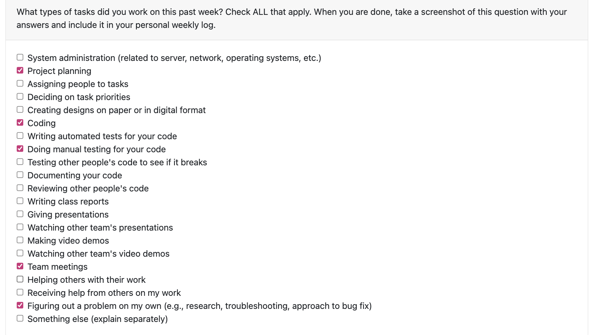
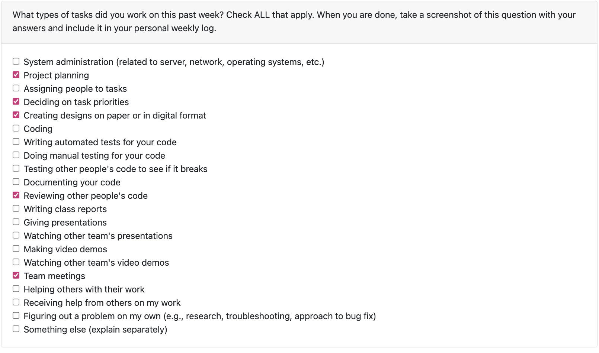
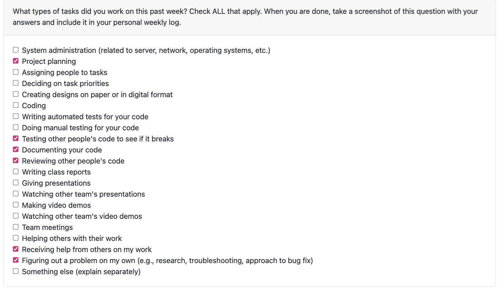
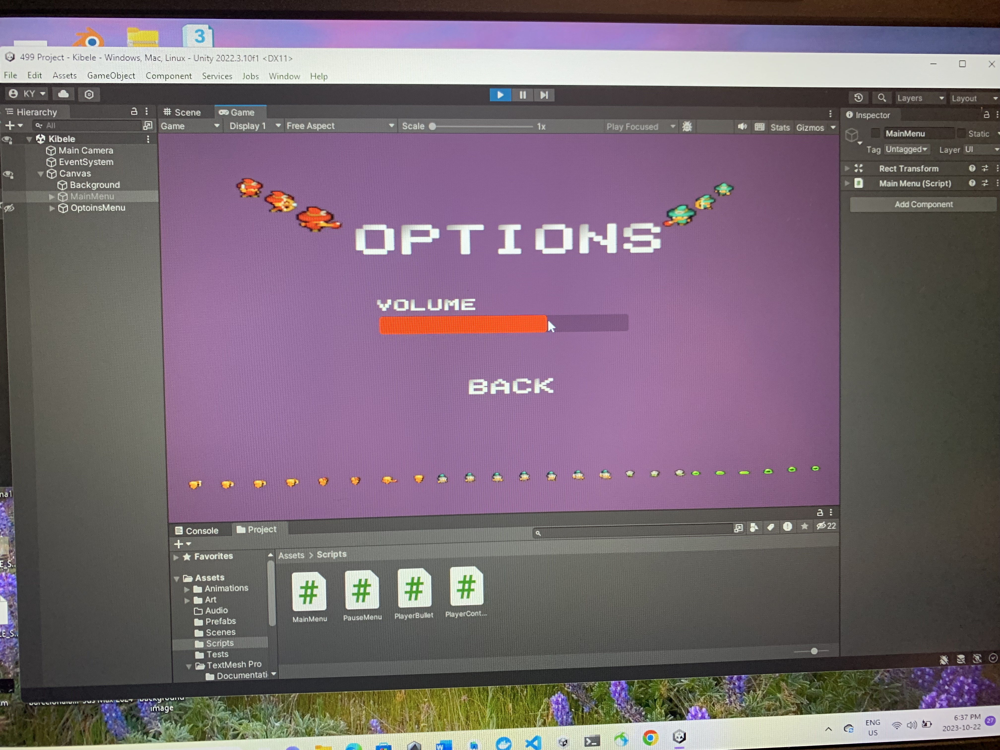
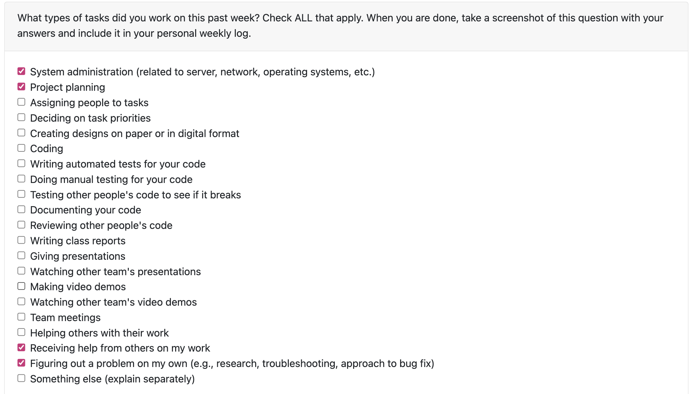
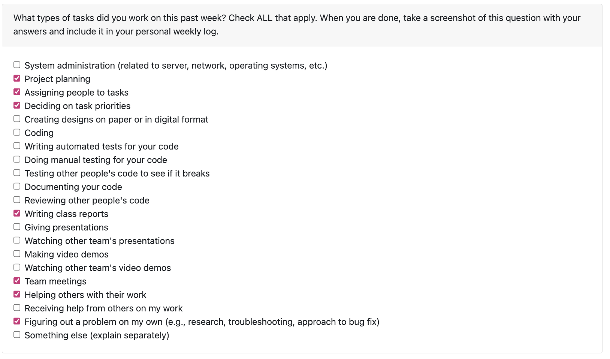

# Personal Log - Kibele Sebnem Yildirim
## Week 19-21 - Term 2
- Start Date: February 13
- End Date: March 3

### Tasks I worked on:

### Recap on your week's goals
- My goals this week were to:
* create options menu accessible inside from the game scene for our game
* Discuss with my team about the design
* Review my teammates' code and fixes on the game
* change design and features in current scenes
* Write code for options menu's code
* Write test for options menu's code

### Which features were yours in the project plan for this milestone?
- My goals for the past week was to create options menu accessible inside from the game scene for our game, discuss with my team about the design, review my teammates' code and fixes on the game, change design and features in current scenes, write code for options menu's code, and write test for options menu's code.

### Among these tasks, which have you completed/in progress in the last week?
- i have completed all my tasks this week. 

Here are the screenshots of my work on our the Options Menu accessible inside Pause Menu in the Game scene in Unity this week:

Here are the screenshots of my codewoek on our the Options Menu accessible inside Pause Menu in the Game scene in Unity this week:

## Week 18 - Term 2
- Start Date: February 5
- End Date: February 12

### Tasks I worked on:

### Recap on your week's goals
- My goals this week were to:
* finalize the difficulty menu for our game
* Discuss with my team about the design
* Review my teammates' code and fixes on the game
* Write test for difficulty menu's code

### Which features were yours in the project plan for this milestone?
- My goals for the past week was to finalize the difficulty menu for our game, discuss with my team about the design, review my teammates' code and fixes on the game, and write test for difficulty menu's code.

### Among these tasks, which have you completed/in progress in the last week?
- i have completed all my tasks this week. 

Here are the screenshots of my work on our Difficulty Menu in Unity this week:

## Week 17 - Term 2
- Start Date: January 29
- End Date: February 5

### Tasks I worked on:

### Recap on your week's goals
- My goals this week were to:
* start and finalize the win menu for our game
* Discuss with my team about the design
* Review my teammates' code and fixes on the game
* Write test for win menu's code

### Which features were yours in the project plan for this milestone?
- My goals for the past week was to start and finalize the win menu for our game, discuss with my team about the design, review my teammates' code and fixes on the game, and write test for win menu's code.

### Among these tasks, which have you completed/in progress in the last week?
- i have completed all my tasks this week. 

Here are the screenshots of my work on our Win Menu in Unity this week:

This is the screenshot of my work on VScode in Win Menu this week:

## Week 16 - Term 2
- Start Date: January 22
- End Date: January 28

### Tasks I worked on:

### Recap on your week's goals
- My goals this week were to:
* start and finalize the win menu for our game
* Discuss with my team about the design
* Review my teammates' code and fixes on the game
* Write test for win menu's code

### Which features were yours in the project plan for this milestone?
- My goals for the past week was to start and finalize the win menu for our game, discuss with my team about the design, review my teammates' code and fixes on the game, and write test for win menu's code.

### Among these tasks, which have you completed/in progress in the last week?
- i have completed all my tasks this week. 

Here are the screenshots of my work on our Win Menu in Unity this week:

This is the screenshot of my work on VScode in Win Menu this week:

## Week 15 - Term 2
- Start Date: January 16
- End Date: January 21

### Tasks I worked on:

### Recap on your week's goals
- My goals this week were to:
* finalize the controls menu for our game
* Discuss with my team about the design
* Review my teammates' work on the game
* Write test for my menu's code

### Which features were yours in the project plan for this milestone?
- My goals for the past week was to finalize the controls menu for our game, discuss with my team about the design, review my teammates' work on the game, and write test for my menu's code.

### Among these tasks, which have you completed/in progress in the last week?
- i have completed all my tasks this week. 

Here are the screenshots of my work on our Controls Menu in Unity this week:

## Week 14 - Term 2
- Start Date: January 8
- End Date: January 15

### Tasks I worked on:

### Recap on your week's goals
- My goals this week were to:
* Create and plan the controls menu for our game
* Discuss with my team about the design
* Review my teammates' work on the game
* Write test for my menu's code

### Which features were yours in the project plan for this milestone?
- My goals for the past week was to create and plan the controls menu for our game, discuss with my team about the design, review my teammates' work on the game, and write test for my menu's code.

### Among these tasks, which have you completed/in progress in the last week?
- i have completed all my tasks this week. 

Here is a screenshot of my work on our Controls Menu in Unity this week:

Here is a screenshot of my work on VScode in Controls Menu this week:

## Week 13
- Start Date: November 28
- End Date: December 3

### Tasks I worked on:

### Recap on your week's goals
- My goals this week were to:
* Contniue my progress on Game Over Menu
* Design the ER Diagram of our Prototype
* Discuss with my team about the design document and the video
* Review my teammates' code on the game

### Which features were yours in the project plan for this milestone?
- My goals for the past week was to continue my progress on Game Over Menu, design the ER Diagram of our Prototype, and discuss with my team about the design document and the video. I have also reviewed my teammates' code on the game.

### Among these tasks, which have you completed/in progress in the last week?
- i have completed all my tasks this week. 

Here is a screenshot of my work on our Game Over Menu in Unity this week:

Here is a screenshot of my work on VScode in Game Over Menu this week:

## Week 12
- Start Date: November 19
- End Date: November 27

### Tasks I worked on:

### Recap on your week's goals
- My goals this week were to:
* Contniue my progress on Game Over Menu
* Discuss with my team about the design document and the video
* Review my teammates' work on the game

### Which features were yours in the project plan for this milestone?
- My goals for the past week was to continue my progress on Game Over Menu and discuss with my team about the design document and the video. I have also reviewed my teammates' work on the game.

### Among these tasks, which have you completed/in progress in the last week?
- i have completed all my tasks this week. 

Here is a screenshot of my work on our Game Over Menu in Unity this week:

Here is a screenshot of my work on VScode in Game Over Menu this week:

## Week 10
- Start Date: November 6
- End Date: November 12

### Tasks I worked on:

### Recap on your week's goals
- My goals this week were to:
* Work on Game Over Menu
* Brainstorm with team about the possible new menu options we can add to our game
* Review my teammates' work on the game

### Which features were yours in the project plan for this milestone?
- My goals for the past week was to work on Game Over Menu and brainstorm with team about the possible new menu options we can add to our game. I have also reviewed my teammates' work on the game. 

### Among these tasks, which have you completed/in progress in the last week?
- i have completed all my tasks this week. I have also improved my abilities on UI and design in game development.

Here is a screenshot of my work on our Game Over Menu in Unity this week:

## Week 9
- Start Date: October 30
- End Date: November 5

### Tasks I worked on:

### Recap on your week's goals
- My goals this week were to:
* Prepare for the mini presentation with my team
* Learn more about Unity Testing Tools and NUnit
* Listen and evaluate other teams' presentations and their work on their mobile app/game/website.
* Present our mini presentation to the class

### Which features were yours in the project plan for this milestone?
- My goals for the past week was to prepare for the mini presentation with my team and learn more about Unity Testing Tools and NUnit. I have also listened and evaluated other teams' presentations and their work on their mobile app/game/website. I have also presented our mini presentation to the class with my team. 

### Among these tasks, which have you completed/in progress in the last week?
- i have completed all my tasks this week. I have also improved my abilities on UI and design in game development.

Here is a screenshot of my work on our Options Menu in Unity this week:

## Week 8
- Start Date: October 23
- End Date: October 29

### Tasks I worked on:

### Recap on your week's goals
- My goals this week were to:
* Learn more about Unity Testing Tools and NUnit
* Write test cases for our game
* Prepare for next week's presentation
* Brainstorm with team about the demo

### Which features were yours in the project plan for this milestone?
- My goals for the past week was to learn more about Unity Testing Tools and NUnit, and write test cases for our game. I have also got prepared for next week's presentation and brainstormed with my team about the demo.

### Among these tasks, which have you completed/in progress in the last week?
- i have completed all my tasks this week. I have also thought of what we can present in the demo and what we can show to the class. 

Here is a screenshot of my codework on Unity:

## Week 6-7
- Start Date: October 9
- End Date: October 22

### Tasks I worked on:

### Recap on your week's goals
- My goals these 2 weeks were to:
* Learn more about main menu and pause menu on Unity
* Learn more about C# language
* Construct the main menu and pause menu for our game
* Improve my skills on Unity and C# language

### Which features were yours in the project plan for this milestone?
- My goals for the past 2 weeks was watching tutorials and practiting the main menu, options menu within main menu and the pause menu, and then constructing one for our game.

### Among these tasks, which have you completed/in progress in the last week?
- I have finalized all my main menu and pause menu tasks. I have also improved my experience in Unity and C# language. 

Here is a screenshot of my exercise on Unity:

Here is a screenshot of my final product of menus on Unity after the end of the week:

***
## Week 5
- Start Date: October 2
- End Date: October 8

### Tasks I worked on:

### Recap on your week's goals
- My goals this week were to:
* Learn more about Unity platform which we decided ti use for our game
* Talk and brainstorm with team about our plans of the game 
* Focus on learning and improving my skills on Unity and game-making

### Which features were yours in the project plan for this milestone?
- I have started learning Unity and watched some tutorials on YouTube. I have set up my Unity account and started to learn the basics of the platform. I have also started to learn C# language which is used in Unity. I have also started to think about the game we are going to make and brainstormed with my team about the game.

### Among these tasks, which have you completed/in progress in the last week?
- I have completed all my tasks this week. I have started to learn Unity and C# language. I have also started to think about the game we are going to make and brainstormed with my team about the game. 

Here is a screenshot of my Unity account and a small portion of the tutorial I watched on YouTube:

***
## Week 4
- Start Date: September 25
- End Date: October 1

### Tasks I worked on:

  
### Recap on your week's goals
- My priorities were to meet with our team to decide on all of the elements that would be integrated in our project, to finish the important milestones section of the project's outline, and to assist my group to establish and finish the collaborative division on our Kanban board.

### Which features were yours in the project plan for this milestone?
- My primary goal this week in our meeting was to finish the important technical objectives. I initiated our Kanban board in an online platform called trello and helped my teammates to assign tasks and complete the teamwork distribution. I have also created the excel file for our timestamps and tasks done with the burnup table and shared with my teammates. We have added the screenshots of our burnup table.

### Among these tasks, which have you completed/in progress in the last week?
- I completed all my tasks this week.

***
## Week 3
- Start Date: September 21
- End Date: September 24

### Tasks I worked on:

### Recap on your week's goals
This week it was great for me to communicate with the pull requests and get familiar with the review feature on GitHub while working with my team
### Which features were yours in the project plan for this milestone?
I have completed the test class for wordChanger feature and also testing the URL if it successively takes it or not on the word chain exercise.
### Among these tasks, which have you completed/in progress in the last week?
I have finalized my test classes for this week. I have also worked on the word chain exercise and tested the URL if it takes it or not.
