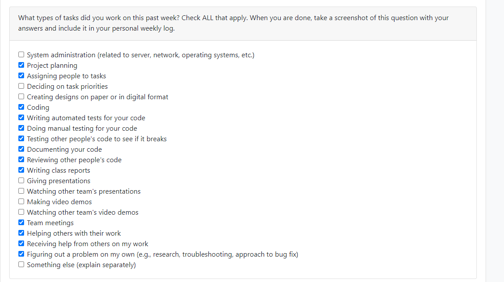

# Personal Log - Justin McKendry
## Week 10
- Start Date: November 5th
- End Date: November 12th

### Tasks I worked on:

  
### Recap on your week's goals
My goals this week were to: 
* Complete unit testing for my previous weeks work.
* Get a better understanding of the scripts my teamates have implemented.
* Decide on which web hosting service to use for uploading our game to a webpage

### Which features were yours in the project plan for this milestone?
My features this week were to:
* Create the unit tests for my previous weeks features

### Among these tasks, which have you completed/in progress in the last week?
I have made completed all of the needed unit test and decided to try to host it on itch.io.

## Week 9
- Start Date: October 30th
- End Date: November 5th

### Tasks I worked on:

  
### Recap on your week's goals
My goals this week were to: 
* Help organize and ensure quality of our presentation.
* Ensure all of my parts were working for our live demo.
* Complete my feature for this week aswell as my other feature so I can start working on stretch goals (without testing since other features are needed first).
* Research webGl and other ways to host our game on a webpage. 

### Which features were yours in the project plan for this milestone?
My features this week were to:
* Create the prefab for the cyan orc.
* Create the prefab for the enemy bullets.
* Create the script for the enemy bullets.

### Among these tasks, which have you completed/in progress in the last week?
I have made completed all of the prefabs and made the script for the enemy bullets.

## Week 8
- Start Date: October 23th
- End Date: October 29nd

### Tasks I worked on:

  
### Recap on your week's goals
My goals this week were to: 
* Complete my unit test as needed
* Document my code effectively
* Get a better understanding of how to unit test in unity
* Help organize our presentation
* Help my team in any areas necessary 

### Which features were yours in the project plan for this milestone?
My features this week were to:
* Create the unit test for Player collision with the level template
* Create the unit test for bullet collision with the level template
* Ensure my unit test did not interfere with any group members unit tests.
* Fill the test folder with the appropriate information
* Create a template for the test report

  
### Among these tasks, which have you completed/in progress in the last week?
I have made completed all of the unit test's and filled out the documents as needed.

## Week 6 and 7
- Start Date: October 9th
- End Date: October 22nd

### Tasks I worked on:

  
### Recap on your week's goals
My goals this week were to: 
* Create The prefab for the bullets, red mage and cyan mage
* Read about our unit testing framework to get a better grasp on how to create unit tests for this upcoming week.
* Review the scripts my teamates created and ensure a proper understanding of how they work.
* Collorbate with my group to ensure there are no bugs in each others code.

### Which features were yours in the project plan for this milestone?
My features this week were to:
* Create the player bullets prefab
* Create the red and cyan mage prefab
* Ensure player's stay in the map when colliding with objects
  
### Among these tasks, which have you completed/in progress in the last week?
I have made all of the prefab's and ensured player collision works properly.

## Week 5
- Start Date: October 2
- End Date: October 8

### Tasks I worked on:

  
### Recap on your week's goals
My goals this week were to: 
* Download and get a grasp of the basic's of Unity to ensure proper perparedness for the upcoming week's of work.

### Which features were yours in the project plan for this milestone?
My features this week were to:
* Download and install unity
* Educate myself on the basic's of it's syntax
* Educate myself on how to use it with Github
* Ensure that I am comfortable to work with it moving forward
### Among these tasks, which have you completed/in progress in the last week?
I have completed all my tasks.

## Week 4
- Start Date: September 25
- End Date: October 1

### Tasks I worked on:

  
### Recap on your week's goals
My goals this week were to: 
* Meet with the team to ensure we had the information we needed for the project plan
* Complete my designated tasks and help with any other tasks I could.

### Which features were yours in the project plan for this milestone?
My features this week were to:
* Describe and justify the technology stack in our project plan.
* Create my personal log and insert the network chart into the team log.
* Help with the set up the Trello board
* Help with creating the Burnup Chart
* Work with the team to divvy up the work set out in section 4 of the Project Plan
### Among these tasks, which have you completed/in progress in the last week?
I have completed all my tasks.

***
