# Personal Log - Justin McKendry

## Week 20 (term 2 week 8)
- Start Date: Feburary 26th 
- End Date: March 3rd

### Tasks I worked on:

  
### Recap on your week's goals
My goals this week were to: 
* Complete the spikes feature
* Ensure our group's preparedness for the peer testing 2 session.

### Which features were yours in the project plan for this milestone?
My features this week were to:
* Develop the spike envrionment object.
  
### Among these tasks, which have you completed/in progress in the last week?
I have completed the spikes feature and collaborated with my group members to ensure our lists of tasks, questionnaire and game was up to date for the peer testing.

## Week 19 (term 2 week 6)
- Start Date: Feburary 12th 
- End Date: Feburary 18th

### Tasks I worked on:

  
### Recap on your week's goals
My goals this week were to: 
* Solve our groups issue with git LFS

### Which features were yours in the project plan for this milestone?
My features this week were to:
* Develop the spike envrionment object.
  
### Among these tasks, which have you completed/in progress in the last week?
I attempted to complete the spikes while still having the issue with git LFS however found I was very limited in my progress. With this being the case the spikes are still in progress.

## Week 18 (term 2 week 5)
- Start Date: Feburary 5th 
- End Date: Feburary 11th

### Tasks I worked on:
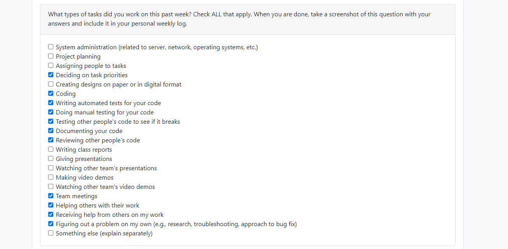
  
### Recap on your week's goals
My goals this week were to: 
* Finish the triple shot enemy 

### Which features were yours in the project plan for this milestone?
My features this week were to:
* Develop the triple shot enemy 
  
### Among these tasks, which have you completed/in progress in the last week?
The triple shot enemy is finished and shoots as intended, with three consequtive shots all with the same speed and direction.

## Week 17
- Start Date: January 29th
- End Date: Feburary 4th

### Tasks I worked on:
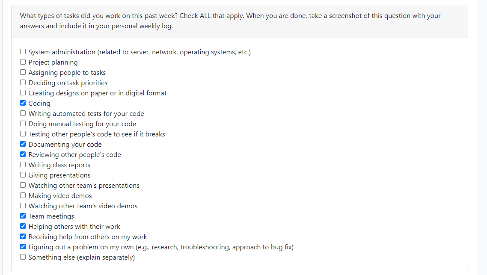
  
### Recap on your week's goals
My goals this week were to: 
* Ensure we had proper level layouts and questions for peer testing

### Which features were yours in the project plan for this milestone?
My features this week were to:
* Develop the triple shot enemy 
  
### Among these tasks, which have you completed/in progress in the last week?
The triple shot enemy is in progress, it currently shoots 3 shots at varying speeds but we would like it to shoot 3 conseqective shots. 

## Week 16
- Start Date: January 22nd
- End Date: January 28th

### Tasks I worked on:
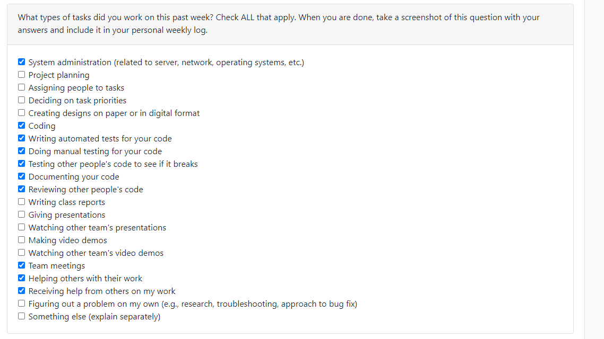
  
### Recap on your week's goals
My goals this week were to: 
* Add the dash feature and appropriate unit tests
* Update the test log with all current tests
* Update the build on the itch website

### Which features were yours in the project plan for this milestone?
My features this week were to:
* Add the dash feature
  
### Among these tasks, which have you completed/in progress in the last week?
I have made completed all of my tasks for this week. 

### First I had to check when the player hits space and call the dash function:

### Second I had to check the cooldown, if the player is alive and if the game is paused. If not increase the force in the move direction and call the invincible script in Health system. Than reset the timer:
.png)

### Third in dashHs we set the player to invinicble than start the Transparent 3 coroutine to make them trnasparent to refelect trasnparency, the transparency works the same as the transparency 2 last week just with differnt times:
.png)

### Finally here are the unit tests:

## Week 15
- Start Date: January 15th
- End Date: January 21st

### Tasks I worked on:

  
### Recap on your week's goals
My goals this week were to: 
* Rework the damage system to make the player invincible shortly after taking damage for a short time.
* Ensure this new code does not break anything previously made.
* Follow up on reworked project plan and ensure proper understanding for all members.

### Which features were yours in the project plan for this milestone?
My features this week were to:
* Rework the damage system to give the player invicibility for a breif period after taking damage.
* Change the anamations to reflect the invicibility.

### Among these tasks, which have you completed/in progress in the last week?
I have made completed all of my tasks for this week. 

### First change was moving everything to do with the functionality of removing health to the healthSystem script and ensure the player does not take damage while invincible:

### Second change was making the player transparent then blink on and off screen in short succession to show the player is invincible:

### Finally here is the unit test for my feature this week:
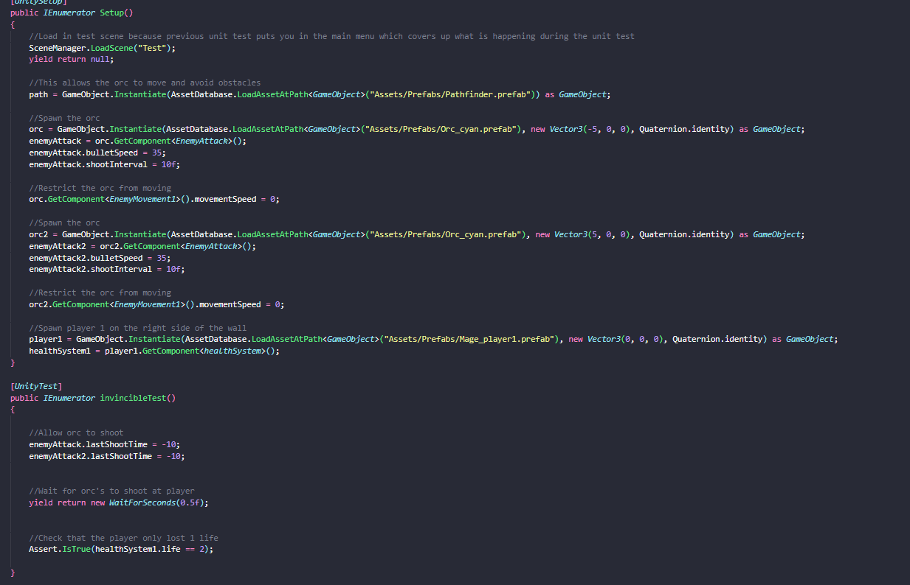

## Week 14
- Start Date: January 8th
- End Date: January 14th

### Tasks I worked on:
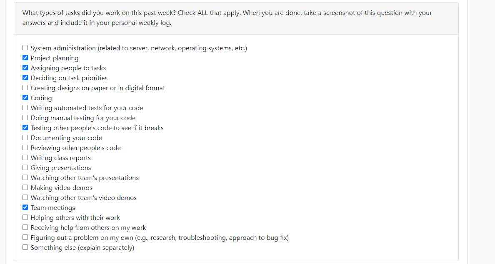
  
### Recap on your week's goals
My goals this week were to: 
* Review all the code to ensure a full understanding for this semester
* Remove collisions between players when playing coop
* Meet with team and review/ revise our plan for the semester

### Which features were yours in the project plan for this milestone?
My features this week were to:
* Remove the collisions between players while playing coop.

### Among these tasks, which have you completed/in progress in the last week?
I have made completed all of my tasks for this week. 
The necessary collosions have been removed.

## Week 13
- Start Date: November 27th
- End Date: December 3rd

### Tasks I worked on:
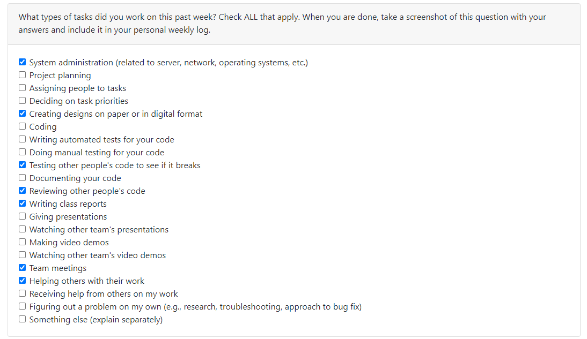
  
### Recap on your week's goals
My goals this week were to: 
* Complete the User Interface Design section of the Design document
* Prepare and organize the design document for submission
* Update and ensure all test are present in the test log

### Which features were yours in the project plan for this milestone?
My features this week were to:
* Create the prefab and collision mechanics for both the orc and their bullets
* Additional:
  * Host the game online
  * Ensure bullets delete on collision with one another
  * Ensure the orc damages the player if they make contact  

### Among these tasks, which have you completed/in progress in the last week?
I have made completed all of my tasks for this week. 
The Design document is ready for submission, the game is hosted online with the most recent build and all of my gameplay mechanics have been implemented in the game.

## Week 12
- Start Date: November 13th
- End Date: November 26th

### Tasks I worked on:

  
### Recap on your week's goals
My goals this week were to: 
* Have the game up and running on a webpage
* Talk to my group about the implementation of abilities
* Do some bug fixing (this includes unit test for these bugs)

### Which features were yours in the project plan for this milestone?
My features this week were to:
* Host the game on a webpage

### Among these tasks, which have you completed/in progress in the last week?
I have made completed all of the needed bug fixes, unit tests and hosting on a web page.
Please see screenshots of the unit test for the bug fixes below, along with that is an image of the game on a web page.
The link to the webpage is here https://magemadness.itch.io/mage-madness .

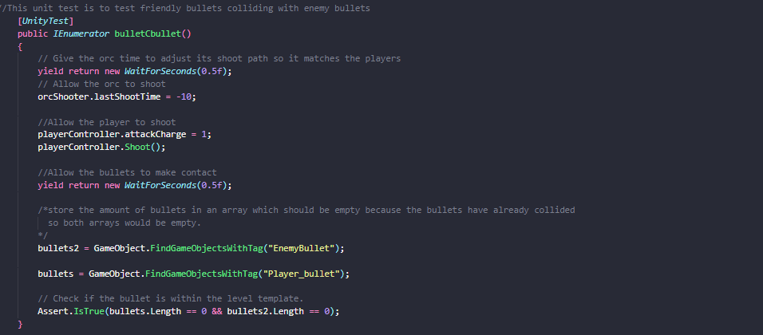

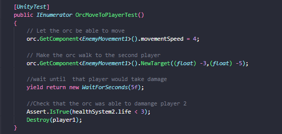

## Week 10
- Start Date: November 5th
- End Date: November 12th

### Tasks I worked on:
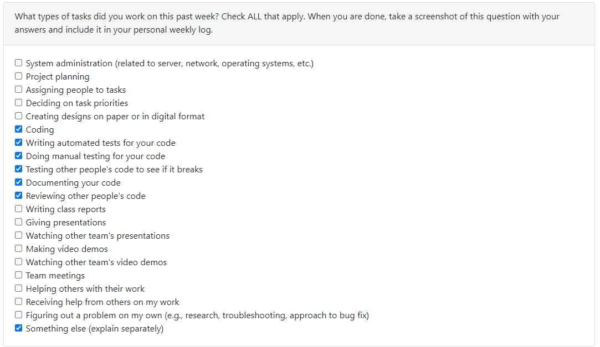
  
### Recap on your week's goals
My goals this week were to: 
* Complete unit testing for my previous weeks work.
* Get a better understanding of the scripts my teamates have implemented.
* Decide on which web hosting service to use for uploading our game to a webpage

### Which features were yours in the project plan for this milestone?
My features this week were to:
* Create the unit tests for my previous weeks features

### Among these tasks, which have you completed/in progress in the last week?
I have made completed all of the needed unit test and decided to try to host it on itch.io.

## Week 9
- Start Date: October 30th
- End Date: November 5th

### Tasks I worked on:

  
### Recap on your week's goals
My goals this week were to: 
* Help organize and ensure quality of our presentation.
* Ensure all of my parts were working for our live demo.
* Complete my feature for this week aswell as my other feature so I can start working on stretch goals (without testing since other features are needed first).
* Research webGl and other ways to host our game on a webpage. 

### Which features were yours in the project plan for this milestone?
My features this week were to:
* Create the prefab for the cyan orc.
* Create the prefab for the enemy bullets.
* Create the script for the enemy bullets.

### Among these tasks, which have you completed/in progress in the last week?
I have made completed all of the prefabs and made the script for the enemy bullets.

## Week 8
- Start Date: October 23th
- End Date: October 29nd

### Tasks I worked on:

  
### Recap on your week's goals
My goals this week were to: 
* Complete my unit test as needed
* Document my code effectively
* Get a better understanding of how to unit test in unity
* Help organize our presentation
* Help my team in any areas necessary 

### Which features were yours in the project plan for this milestone?
My features this week were to:
* Create the unit test for Player collision with the level template
* Create the unit test for bullet collision with the level template
* Ensure my unit test did not interfere with any group members unit tests.
* Fill the test folder with the appropriate information
* Create a template for the test report

  
### Among these tasks, which have you completed/in progress in the last week?
I have made completed all of the unit test's and filled out the documents as needed.

## Week 6 and 7
- Start Date: October 9th
- End Date: October 22nd

### Tasks I worked on:
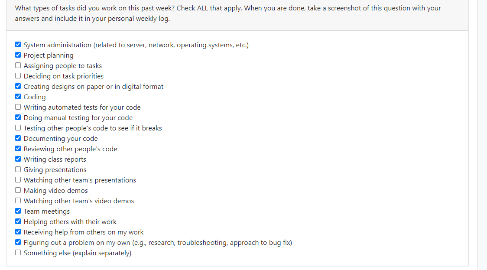
  
### Recap on your week's goals
My goals this week were to: 
* Create The prefab for the bullets, red mage and cyan mage
* Read about our unit testing framework to get a better grasp on how to create unit tests for this upcoming week.
* Review the scripts my teamates created and ensure a proper understanding of how they work.
* Collorbate with my group to ensure there are no bugs in each others code.

### Which features were yours in the project plan for this milestone?
My features this week were to:
* Create the player bullets prefab
* Create the red and cyan mage prefab
* Ensure player's stay in the map when colliding with objects
  
### Among these tasks, which have you completed/in progress in the last week?
I have made all of the prefab's and ensured player collision works properly.

## Week 5
- Start Date: October 2
- End Date: October 8

### Tasks I worked on:

  
### Recap on your week's goals
My goals this week were to: 
* Download and get a grasp of the basic's of Unity to ensure proper perparedness for the upcoming week's of work.

### Which features were yours in the project plan for this milestone?
My features this week were to:
* Download and install unity
* Educate myself on the basic's of it's syntax
* Educate myself on how to use it with Github
* Ensure that I am comfortable to work with it moving forward
### Among these tasks, which have you completed/in progress in the last week?
I have completed all my tasks.

## Week 4
- Start Date: September 25
- End Date: October 1

### Tasks I worked on:
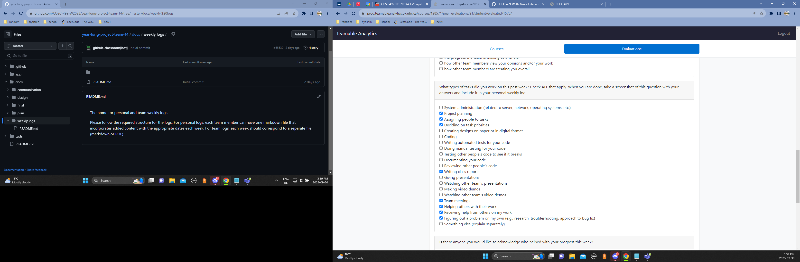
  
### Recap on your week's goals
My goals this week were to: 
* Meet with the team to ensure we had the information we needed for the project plan
* Complete my designated tasks and help with any other tasks I could.

### Which features were yours in the project plan for this milestone?
My features this week were to:
* Describe and justify the technology stack in our project plan.
* Create my personal log and insert the network chart into the team log.
* Help with the set up the Trello board
* Help with creating the Burnup Chart
* Work with the team to divvy up the work set out in section 4 of the Project Plan
### Among these tasks, which have you completed/in progress in the last week?
I have completed all my tasks.

***
