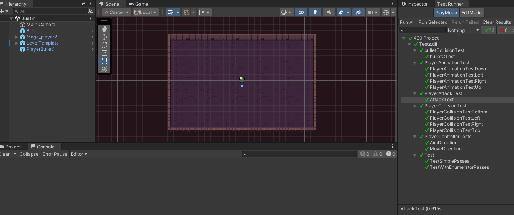
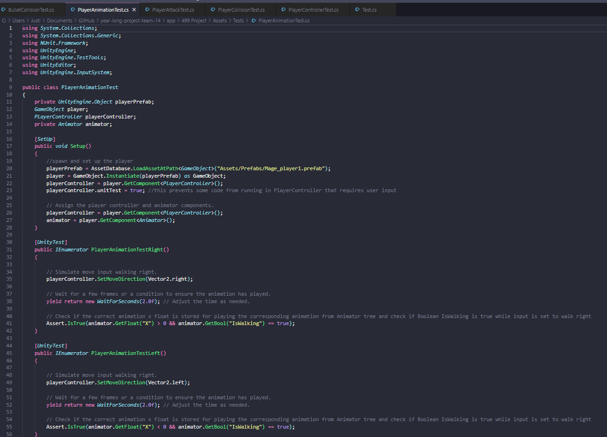
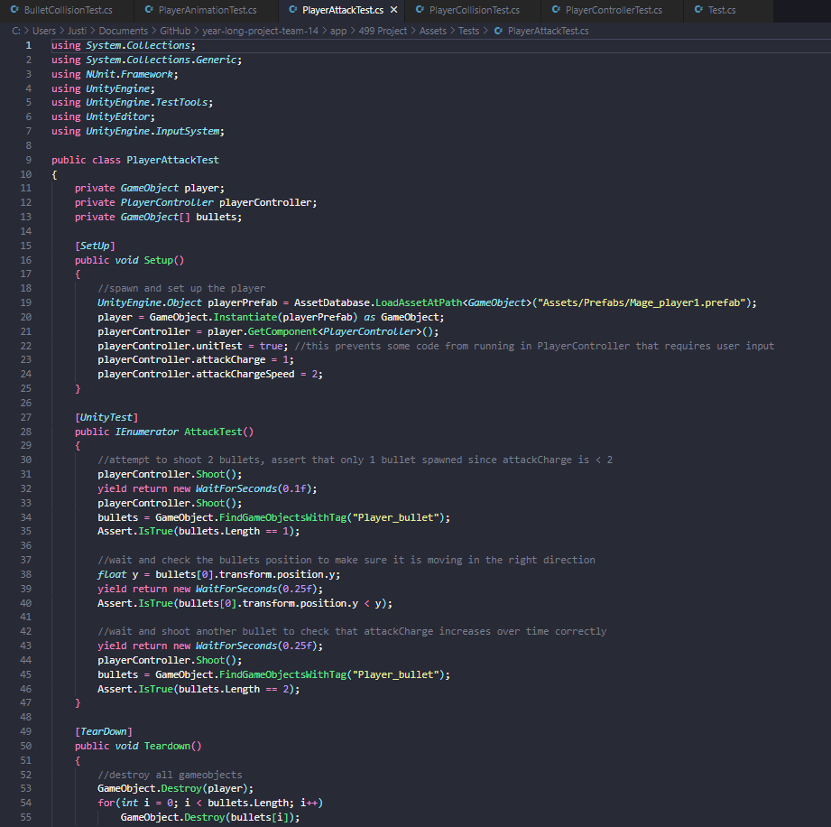

# Test Log
## Tests passing

## Test for bullet collisions with the level template 

How this test works:
  * Spawn a player that shoots directly down.
  * Move player to the left so as not to collide with the bullet.
  * Ensure bullet is still within the y position of the playspace.
  * Don't need to check for the x position as the colliders are all the same so if it works for y position it will work for x.

## Test for player animation

How this test works:
  * Spawn a player
  * Set playerController to move joystick in a specific direction
  * Assert that Animator Tree is storing the corresponding x,y position and playing correct animation

## Test for player attack

How this test works:
  * Spawn a player and initialize some attributes.
  * Attempt to shoot 2 bullets and check that only 1 bullet spawns to ensure that the players cannot shoot when they have no ammo.
  * Check the bullets position to make sure it moves in the correct direction.
  * Wait some time and shoot another bullet to test that ammo recharges over time.

## Test for player Collision

How this test works:
  * Instantiate a player
  * Make that player walk in a direction for 5 seconds (long enough to hit the level template wall/ collider)
  * Check and make sure that player is within the level template still

## Test for player controls 

How this test works:
  * Spawn a player
  * set the player's move direction to up
  * Assert that the player is moving up (only need to test one direction as the input system rather knows all directions or none)
  * set the player's aim direction to the right
  * Assert that the player's bullet is facing right (only need to test one direction as the input system rather knows all directions or none)

## Test for main menu

How this test works:
* loads the menu scene from Unity
* checks if the menu scene is loaded
* checks if the play button is existed in the menu scene
* checks if the ser clicking the "playButton" and the game scene is loaded
* cleans up the scene

## Test for pause menu

How this test works:
* PauseMenu_ResumeGame:
  * checks if the game scene is loaded
  * checks if the pause menu is existed in the game scene and is active
  * checks if the resume button is existed in the pause menu
  * checks if the user clicking the "resumeButton" and the game scene is loaded

* PauseMenu_LoadMenu:
    * checks if the menu scene is loaded
    * checks if the pause menu is existed in the game scene and is active
    * checks if the load menu button is existed in the pause menu
    * checks if the user clicking the "loadMenuButton" and the menu scene is loaded

* PauseMenu_Restart:
    * creates a new instance of the PauseMenu
    * yields control to complete the Unity testing

