# Test Log
## Tests passing
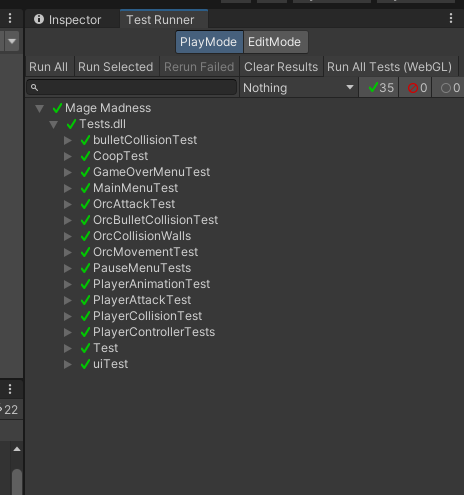

## Test for bullet collisions

How this test works:
  * Spawn both a player and an enemy
  * Make the player move left
  * Wait then shoot
  * Make the player move left again
  * Store the bullet in an array and then ensure its within the boundarys of the level

How this test works:
  * Spawn a player and an enemy
  * Have them wait to adjust the orcs bullet path
  * Have them shoot at the same time
  * Wait untill bullets collide
  * Store the bullets of player and enemy in an array
  * Check if the arrays in ^ are empty (which they should be as both bullets would delete from the scene when they collide and thus nothing would be stored)
  * If there empty the test pass
  * (This test is for bullets colliding with bullets) 

## Test for player animation
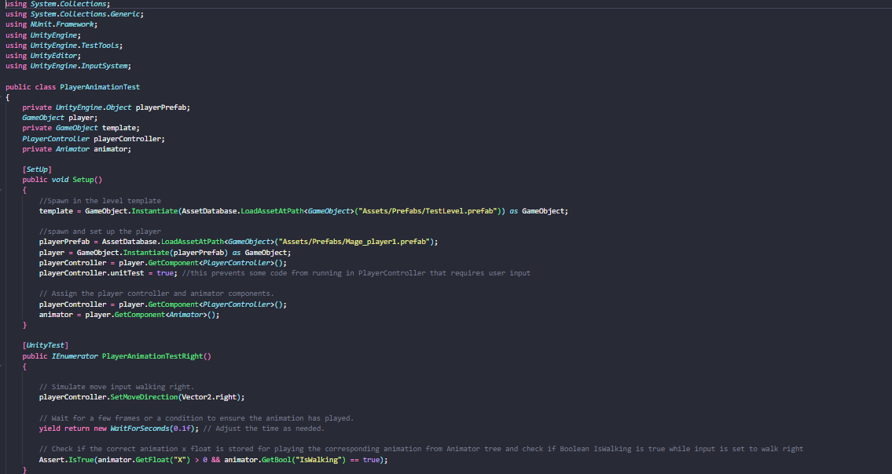
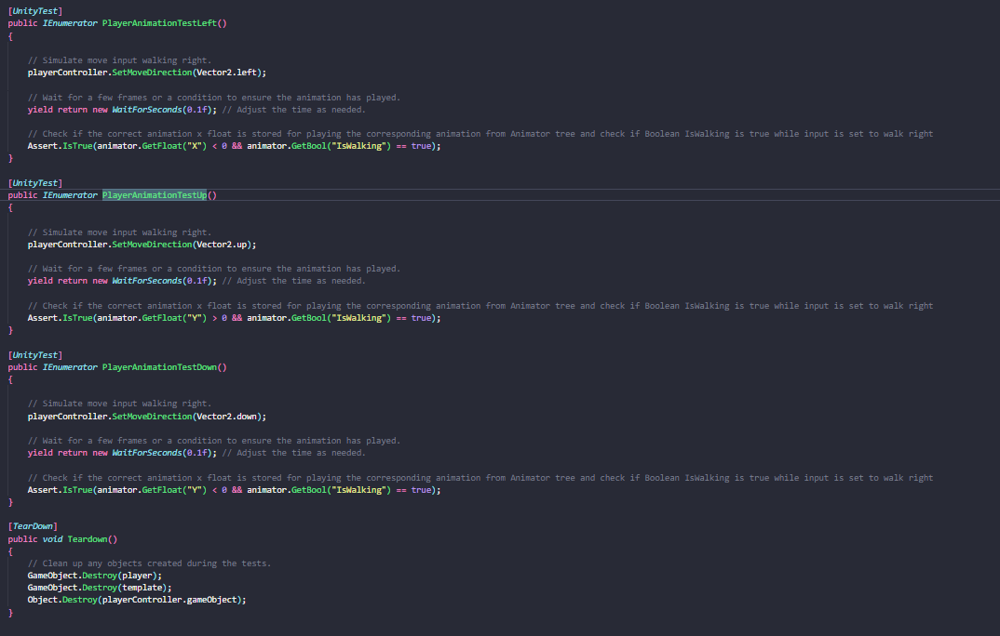

How this test works:
  * Spawn a player
  * Set playerController to move joystick in a specific direction
  * Assert that Animator Tree is storing the corresponding x,y position and playing correct animation

## Test for player attack

How this test works:
  * Spawn a player and initialize some attributes.
  * Attempt to shoot 2 bullets and check that only 1 bullet spawns to ensure that the players cannot shoot when they have no ammo.
  * Check the bullets position to make sure it moves in the correct direction.
  * Wait some time and shoot another bullet to test that ammo recharges over time.

## Test for player Collision

How this test works:
  * Instantiate a player
  * Make that player walk in a direction for 5 seconds (long enough to hit the level template wall/ collider)
  * Check and make sure that player is within the level template still

## Test for player controls 

How this test works:
  * Spawn a player
  * set the player's move direction to up
  * Assert that the player is moving up (only need to test one direction as the input system rather knows all directions or none)
  * set the player's aim direction to the right
  * Assert that the player's bullet is facing right (only need to test one direction as the input system rather knows all directions or none)

## Test for main menu
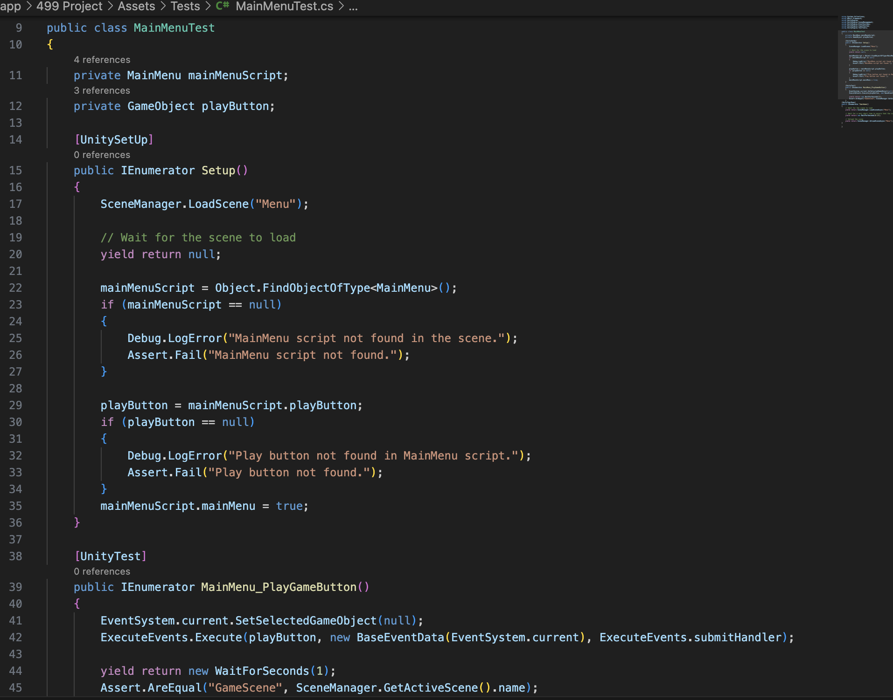

How this test works:
* loads the menu scene from Unity
* checks if the menu scene is loaded
* checks if the play button is existed in the menu scene
* checks if the ser clicking the "playButton" and the game scene is loaded
* cleans up the scene

## Test for pause menu
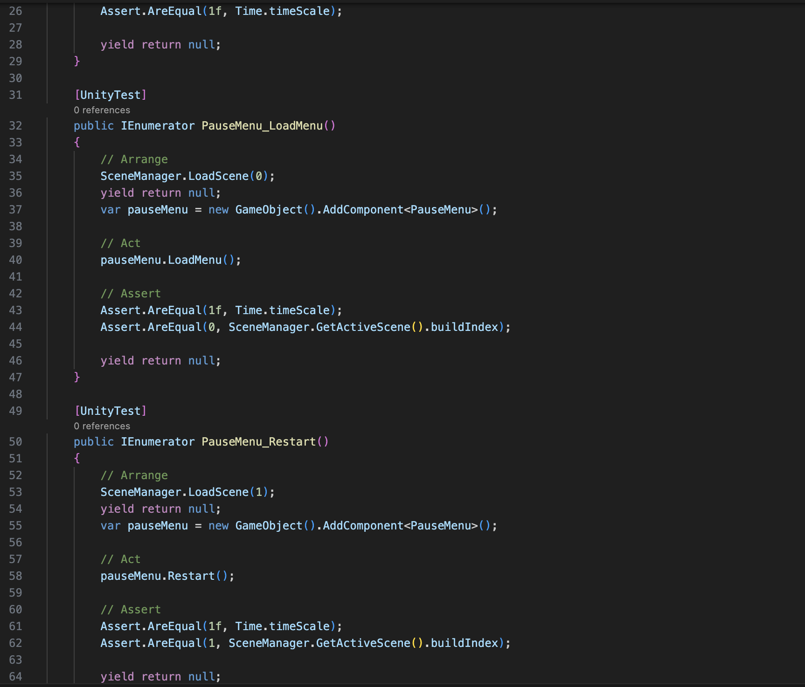

How this test works:
* PauseMenu_ResumeGame:
  * checks if the game scene is loaded
  * checks if the pause menu is existed in the game scene and is active
  * checks if the resume button is existed in the pause menu
  * checks if the user clicking the "resumeButton" and the game scene is loaded

* PauseMenu_LoadMenu:
    * checks if the menu scene is loaded
    * checks if the pause menu is existed in the game scene and is active
    * checks if the load menu button is existed in the pause menu
    * checks if the user clicking the "loadMenuButton" and the menu scene is loaded

* PauseMenu_Restart:
    * creates a new instance of the PauseMenu
    * yields control to complete the Unity testing

## Test for COOP
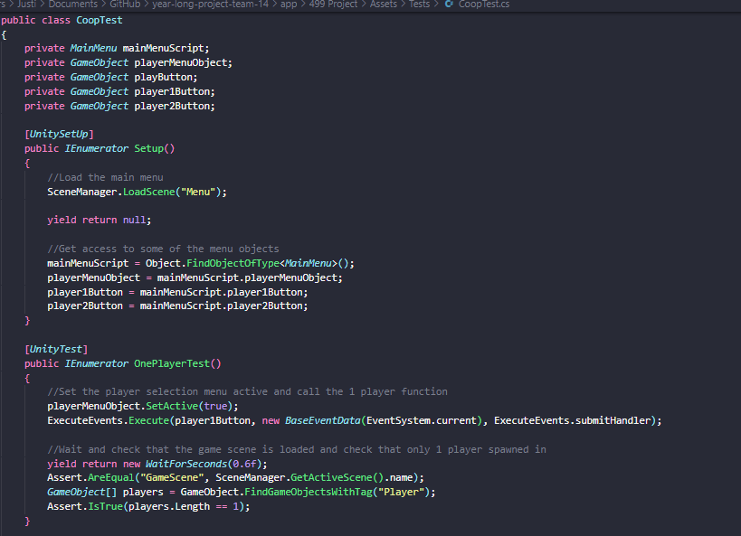

How this test works:
*

## Test for Game Over Menu

## Test for Orc Attack's
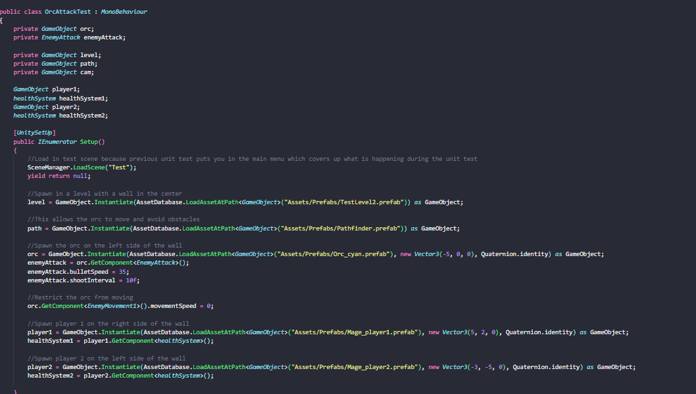
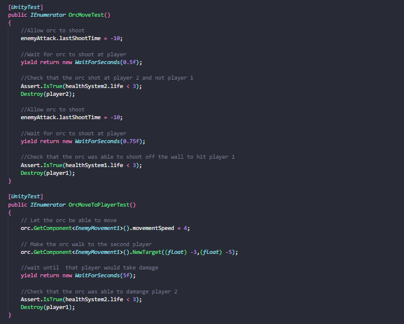
How OrcMoveToPlayerTest works:
* Spawn both a player and an orc
* Have the orc move to the player
* Check that the player's health has decreased, if so the test pass's

## Test for Orc Bullet Collision

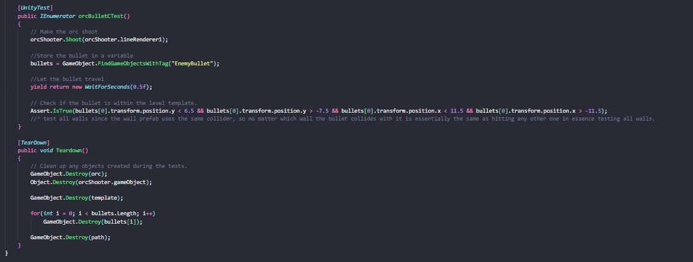

How this test works:
* Spawn an orc
* Have the orc shoot
* Wait and then check if the bullet is within the boundary's of the level (if so it pass's)

## Test for Orc Collision with walls
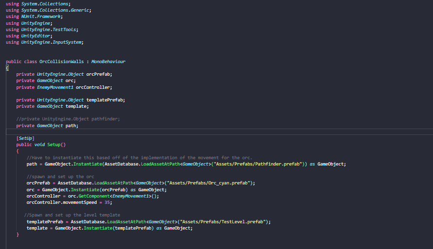

How this test works:
* Spawn an orc
* Have it move towards a wall
* Wait and then ensure it is within the boundary's of the level
* If so then it pass's

## Test for Orc Movement

How this test works:
*

## Test for Pause menu
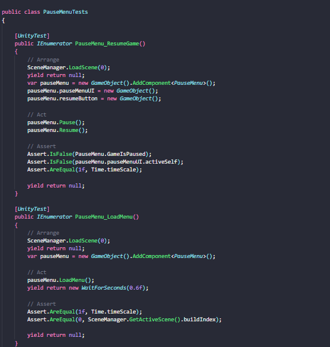
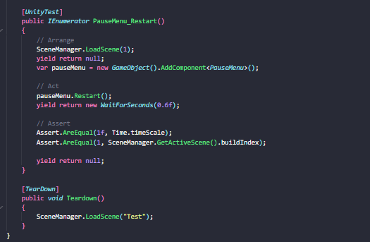

How this test works:
*

## Test for the ui
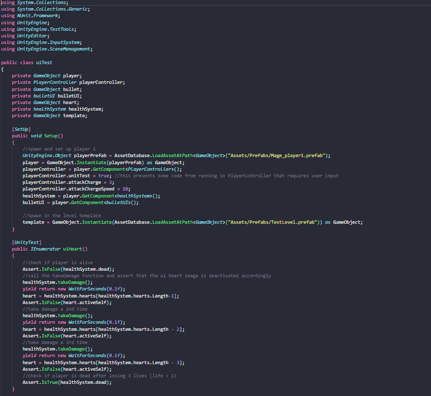
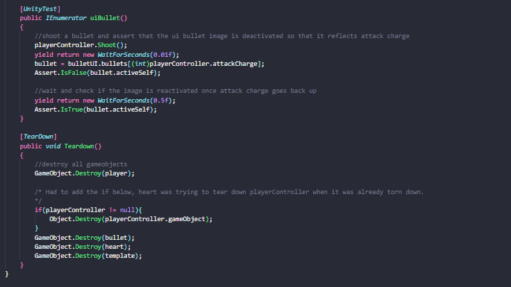

How this test works:
*

